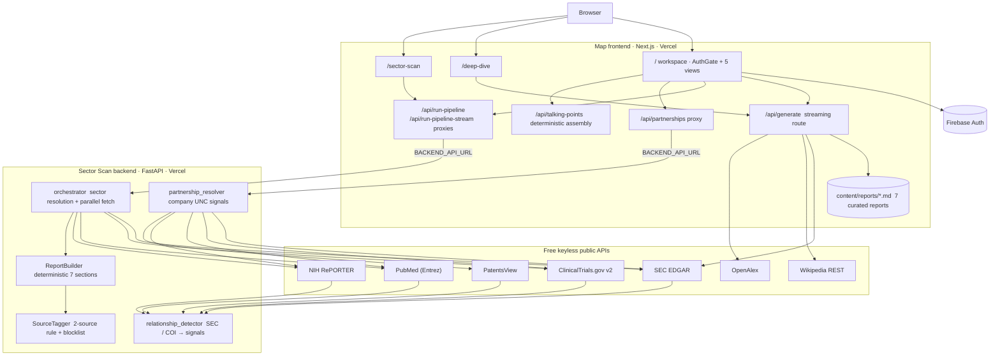
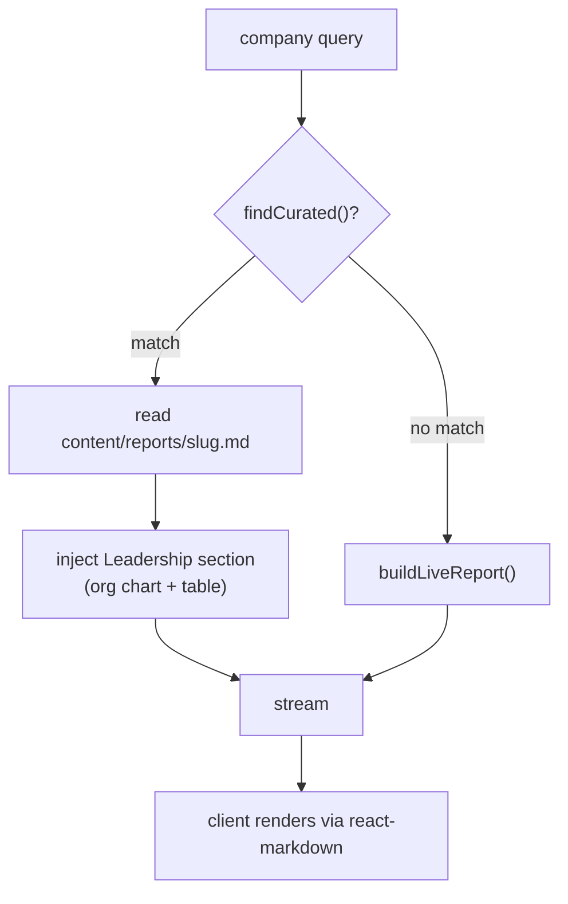
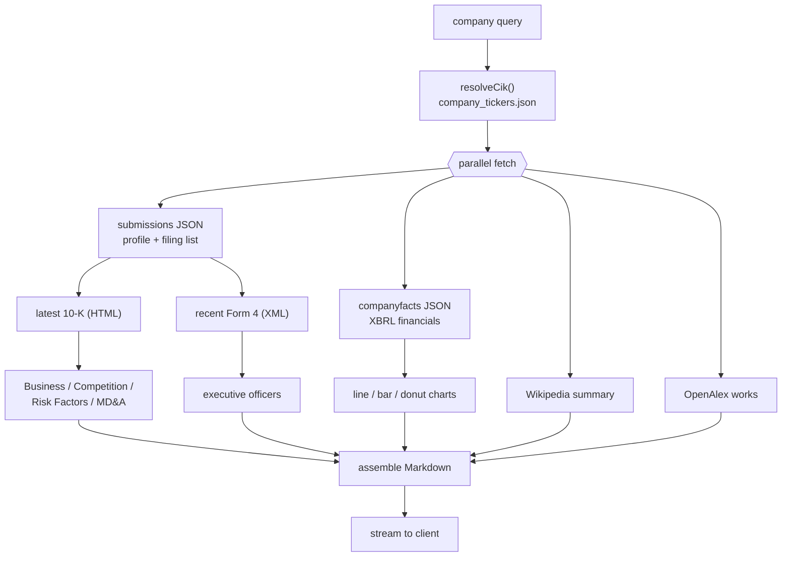
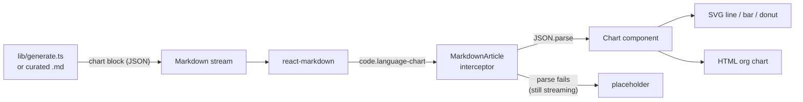
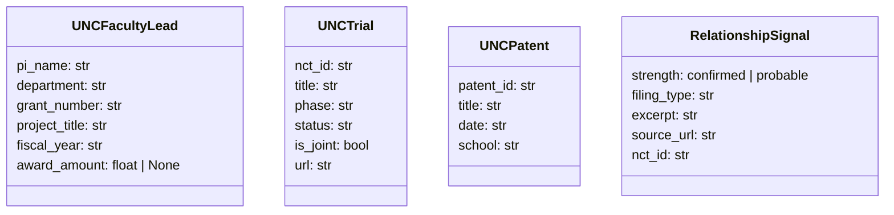
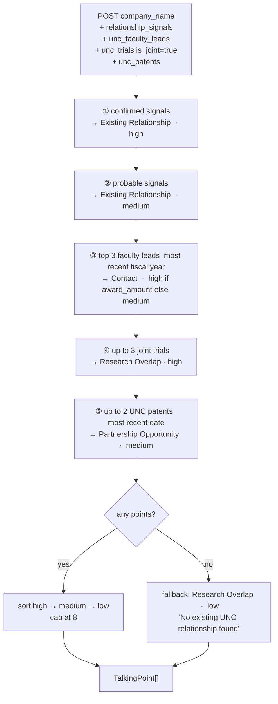
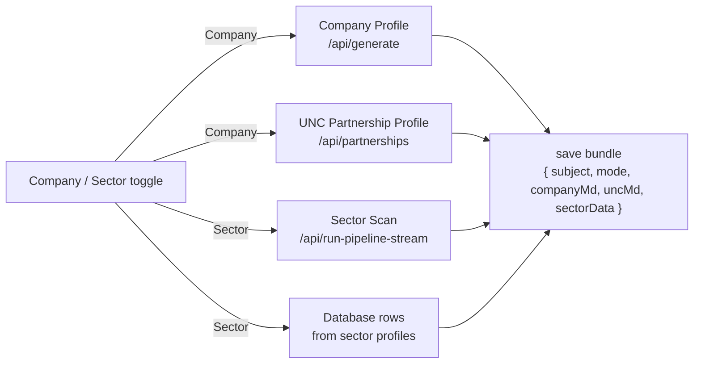
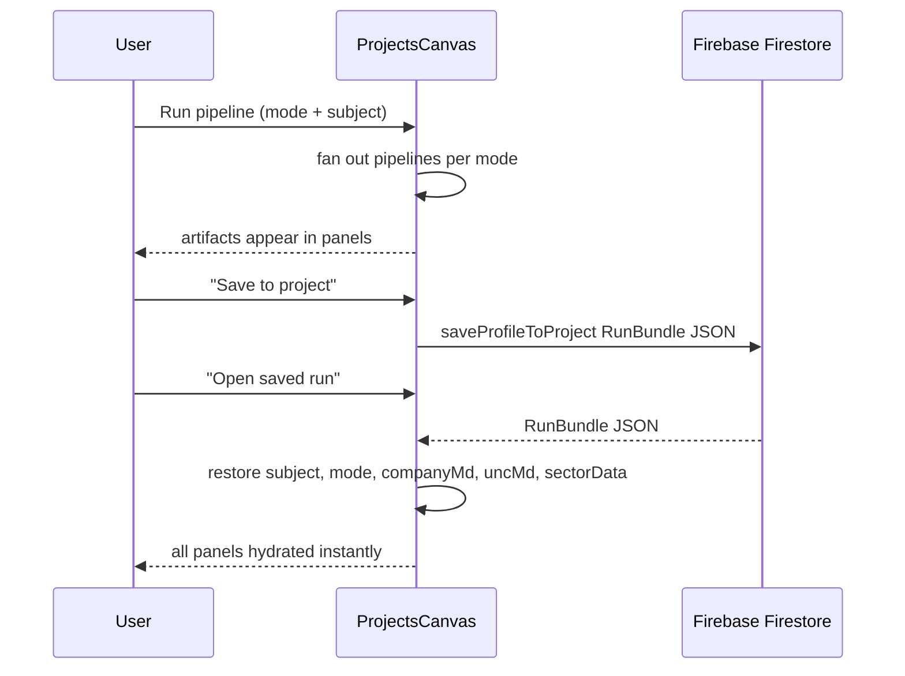
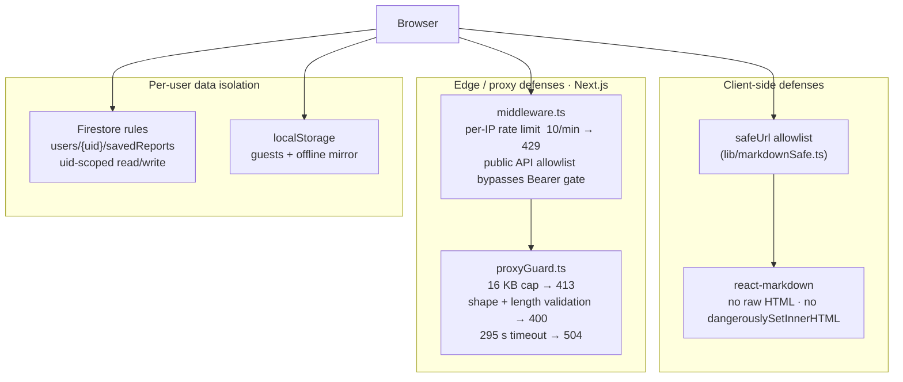

# Map

One web app with three report engines behind a single sign in.

* **Company Profile**: board-ready intelligence reports on any public company. Full financial statements, narrative lifted from the company's own SEC filings, leadership org charts, streamed charts.
* **Sector Scan** (from *map / ARIA PI*): partnership intelligence for university technology transfer. Type a sector, get a fully sourced report mapping public companies to overlapping research at UNC Chapel Hill, scored and citation-checked, in about a minute.
* **UNC Partnership Intelligence**: for every company, surfaces verifiable UNC links — NIH grants, co-authored PubMed papers, ClinicalTrials.gov joint trials, SEC filing mentions, conflict-of-interest disclosures — and assembles them into ready-to-send BD talking points with zero LLM calls.

The hard constraint behind every design decision: **completely free to run.**

> No language model in the request path. No API keys. No per-use cost.
> Every number, sentence, and citation traces to a free, keyless public data source.

> **Disclaimer.** Independent project. Not created by, affiliated with, or endorsed by UNC Chapel Hill or any of its offices. UNC appears only as the analytical subject of the reports the tool generates. For information only. Not investment advice.

## Table of contents

1. [What it does](#what-it-does)
2. [How it stays free](#how-it-stays-free)
3. [System architecture](#system-architecture)
4. [Engine 1: Company Profile](#engine-1-company-profile)
5. [Engine 2: Sector Scan](#engine-2-sector-scan)
6. [Engine 3: UNC Partnership Intelligence](#engine-3-unc-partnership-intelligence)
7. [Talking Points generator](#talking-points-generator)
8. [Projects canvas](#projects-canvas)
9. [Company database](#company-database)
10. [Authentication](#authentication)
11. [Security and privacy](#security-and-privacy)
12. [Data sources](#data-sources)
13. [Repository layout](#repository-layout)
14. [Local development](#local-development)
15. [Environment variables](#environment-variables)
16. [Deployment](#deployment)
17. [Performance and limits](#performance-and-limits)
18. [Data integrity rules](#data-integrity-rules)
19. [Limitations](#limitations)
20. [License](#license)

## What it does

The app has three surfaces.

**The workspace at `/`** sits behind an auth gate and shows six views from one top nav:

| View | What it shows |
|---|---|
| Dashboard | Launchpad. Editorial hero, one search box, a rotating 3D orbit. Type a name, press enter, and it opens a new Project that runs the full pipeline. |
| Company | Company Profile embedded as a canvas card. Search any public company, the report streams in. |
| Sector | Sector Scan embedded as a canvas card. Live progress ("N of M companies"), ticker grid, full report. Clicking a ticker cross-loads that company into the Company view. |
| Partnerships | UNC Partnership Intelligence. Company or sector toggle. Verifiable UNC signals (papers, grants, trials, SEC mentions) plus a Talking Points card for BD outreach. |
| Data | 300 companies as an interactive table: live search, type filters, sortable columns, CSV / Excel / PDF / Markdown export. |
| Projects | Bundles a full pipeline run into one saved project. See [Projects canvas](#projects-canvas). |

**The Projects canvas** bundles a full pipeline run into one project. A **mode toggle** picks which pipelines run. **Auto** reads the typed text and decides; **Company** and **Sector** force the choice:

| Mode | Pipelines | Panels active |
|---|---|---|
| Auto | reads the text, runs Company or Sector | set by what it detects |
| Company | Company Profile + UNC Partnership | Company Profile, UNC Partnership Profile |
| Sector | Sector Scan + Database | Sector Scan, Database |

**The standalone pages** carry the two source apps intact:

| Route | What it is |
|---|---|
| `/deep-dive` | The full Company Profile app: search, streaming markdown reader, table of contents, intro splash. |
| `/sector-scan` | The full Sector Scan workspace with five views: Report, Visualize, Trends, Excel, Slide Deck. |

## How it stays free

A normal "AI report generator" calls an LLM, which costs money and needs a key. Map replaces the LLM with three ideas:

1. **Curated reports.** Seven marquee companies (Apple, NVIDIA, Microsoft, Alphabet, AWS, Anthropic, OpenAI) are hand-written company profiles, grounded in real SEC numbers and stored as Markdown in the repo. They render instantly with zero network calls.
2. **Live reports.** Any other public company, and every sector scan, is assembled on demand from free, keyless public APIs (SEC EDGAR, Wikipedia, OpenAlex, ClinicalTrials.gov, PubMed, NIH RePORTER). No synthesis model. The company profile narrative is the company's *own* words, lifted from its latest 10-K.
3. **Deterministic talking points.** The Talking Points generator is template assembly from structured data — no LLM, no API key, no cost. It reads the partnership evidence already fetched and emits up to 8 ranked points.

A legacy `claude_client.py` exists in the backend but is not on the pipeline path; it falls back to a deterministic stub when no key is set. No key is required or set anywhere.

## System architecture



Two independently deployed Vercel projects:

* **Frontend** (`map/`): the Next.js app. Company profile, partnership lookup, and talking-points assembly all run *inside* it as route handlers. The `/api/run-pipeline*` and `/api/partnerships` routes are server-side proxies so the browser never calls the backend directly.
* **Backend** (`backend/`): FastAPI on the `@vercel/python` runtime. Resolves sectors, fans out to public APIs, assembles the report, and resolves company UNC partnership signals.

The frontend-to-backend connection is one env var, `BACKEND_API_URL`. Nothing else is shared.

## Engine 1: Company Profile

### The two report paths



`findCurated()` (in `map/lib/registry.ts`) normalizes the query and matches it against each curated company's slug, name, ticker, and aliases. So `AAPL`, `apple`, and `Apple Inc.` all resolve to the curated Apple report, `claude` resolves to Anthropic, and `chatgpt` resolves to OpenAI.

### Live report assembly

For a non-curated company, `buildLiveReport()` fans out to every free source in parallel, then assembles the report section by section.



The assembled report contains: Executive Summary, Company Overview, Strategic Direction (10-K Business), Business Model and Financials (tables and charts), Competitive Positioning, Key Risks, Recent SEC Filings, Research Signals, Outlook (MD&A), Leadership (org chart), Sources.

### 10-K narrative extraction

The narrative sections are the company's own words, parsed from the most recent 10-K. `sliceItems()` indexes every `Item N` marker and keeps the longest block per item. `htmlToText()` strips tags, decodes numeric HTML entities, and preserves block boundaries. `excerpt()` trims to a sentence boundary and sanitizes Markdown. `riskHeadlines()` heuristically pulls short bold-style risk category lines.

### Executive extraction (Form 4)

Leadership for live companies comes from SEC Form 4 filings, whose raw XML carries each reporting owner's name and officer title — far more reliable than parsing the 10-K's officer table. The pipeline picks 10 recent Form 4 filings, normalizes names (Last-First-Middle → natural order), normalizes title casing, ranks by seniority, dedupes, and keeps the top 6.

### Financial data (XBRL)

`fetchFinancials()` reads the SEC's XBRL company facts and builds clean annual series. `mergedAnnual()` fills each fiscal year from the highest-priority concept that reports it, yielding a continuous multi-year series for revenue, gross profit, operating income, net income, R&D, assets, liabilities, equity, and buybacks.

### The chart system

Charts are dependency-free: hand-rolled SVG (line, bar, pie, donut) and HTML (org chart). They travel *inside the Markdown* as fenced `chart` code blocks carrying a JSON spec, intercepted at render time.



While a chart block is still streaming (incomplete JSON), the interceptor shows a placeholder; once the closing fence arrives it parses and renders.

## Engine 2: Sector Scan

Given a sector (for example `Oncology`, `Semiconductors`, or `Energy Minerals`), the backend:

1. Resolves the sector to a company set: 24 curated sectors or live SEC EDGAR full-text discovery for niche terms.
2. Pulls primary-source data per company, in parallel, from SEC EDGAR, ClinicalTrials.gov, PubMed, and NIH RePORTER.
3. Builds a deterministic 7-section report plus a one-page executive summary, every claim backed by at least two citable URLs.
4. Streams real progress to the browser as each company resolves.


If streaming is unavailable, the frontend falls back to the plain `/run-pipeline` request plus a cosmetic progress animation.

### Report structure

| # | Section | Highlights |
|---|---|---|
| Summary | Executive brief | metric tiles, thesis, pie charts, SEC snapshot, NC context, UNC units |
| 1 | Sector Overview | definition, scale, why now, NC context, UNC units; revenue and R&D charts |
| 2 | Internal Mapping | known partnerships, faculty, data assets, risk flags; alignment chart |
| 3 | Company Selection | selected vs excluded; UNC tie and partnership scale pie charts |
| 4 | Company Profiles | per-company facts, filings, pipeline, partnering, UNC alignment, signals |
| 5 | Value Proposition | data assets, research capacity, talent, NC access, models |
| 6 | Talking Points | sourced per-company outreach points |
| 7 | References | AMA style, deduplicated, numbered |

### The five-view workspace (`/sector-scan`)

| View | What it shows | Export |
|---|---|---|
| Report | 7-section report + one-page summary, inline AMA citations, scroll-spy TOC | Markdown, PDF, Word |
| Visualize | 23 sector-specific charts led by a rotating 3D connection orbit (companies circling a central UNC node), 3D isometric scatter, Sankey flow, correlation matrix, Lorenz curve, Pareto, radar, heatmap | PDF / Word |
| Trends | Stock-style 10-year SEC financial trajectories (revenue, R&D, net income) with CAGR and momentum | — |
| Excel | 18-sheet analytics workbook (HHI concentration, correlation, quartiles, CAGR, partnership priority scores) | `.xlsx` |
| Slide Deck | Bullet-driven, per-sector deck with speaker notes | `.pptx` |

## Engine 3: UNC Partnership Intelligence

The UNC panel answers two BD questions: *Is this company already a UNC partner?* and *If not, why should they be?* Every fact is tied to a primary source.

### Data pipeline


### What the frontend renders

After every company search, four evidence tiers appear:

| Card | Source | Signal type |
|---|---|---|
| Partner Status Banner | all sources combined | depth: Active / Exploratory / None confirmed |
| UNC Research Contacts | NIH RePORTER grants | named PIs + departments |
| Active Programs | ClinicalTrials.gov | UNC-site trials, phase, status |
| UNC Units | PubMed affiliation | schools with paper counts |
| Clinical / Research | PubMed co-authorship | papers with PMIDs |
| Financial / Legal | SEC EDGAR 10-K | verbatim UNC sentences |
| University Ecosystem | web search | official unc.edu mentions |
| **Talking Points** | all above | ranked BD outreach points |

A downloadable Markdown report bundles all evidence into the same export format as the Company Profile (PDF, DOCX, Markdown).

### Signal shapes



## Talking Points generator

`/api/talking-points` is a deterministic POST endpoint — no LLM, no API key, no cost. It receives the already-fetched partnership payload and assembles up to 8 `TalkingPoint` rows sorted by strength.

### Assembly rules



### TalkingPoint schema

```typescript
interface TalkingPoint {
  category: "Research Overlap" | "Existing Relationship" | "Partnership Opportunity" | "Contact";
  headline: string;   // one sentence, max 120 chars
  detail:   string;   // supporting evidence + source, max 200 chars
  strength: "high" | "medium" | "low";
}
```

### Talking Points card

In the UNC panel, the card renders below the "Why UNC" section after every company search. While the `/api/talking-points` fetch is in flight, three shimmer-skeleton rows are shown.

| Element | Behavior |
|---|---|
| Strength pill | Green (High) · Yellow (Medium) · Muted (Low) |
| Category label | Small muted uppercase above the headline |
| Headline | Semibold, full width |
| Detail | Muted small text; URLs detected and rendered as "View source →" links |
| "Copy all as text" | Copies all points to clipboard as `[Category] Headline\n→ Detail` — paste directly into an outreach email |

## Projects canvas

The Projects canvas bundles a full pipeline run into one named project, saved to Firebase and reopenable offline.

### Mode toggle



When mode = **Company**, the Sector Scan and Database panels show `"Run a Sector scan to populate…"`. When mode = **Sector**, the Company Profile and UNC Partnership panels show `"Run a Company search to populate…"`. Reopening a saved run restores the toggle, all artifact Markdown, and the sector data — no re-fetch required.

### Save / reopen flow



## Company database

The Database view renders 154 companies parsed from the UNC industry company load template and enriched by research. Each profile carries aliases, parent account, sector profiles, description, structure, ownership, address, founded year, employees, revenue, and an auth-gated link to the source report.

It renders as an interactive table: live search across name / sector / HQ, type-filter pills (Public / Private / Nonprofit / Government), click-to-sort columns, structure pills, exchange tags, and a pinned first column. Downloads: CSV of the currently filtered set, plus `.xlsx`, landscape PDF, and raw Markdown.

* Data lives in `map/components/workspace/accountsData.ts`; full citations in `ACCOUNTS_DATA.md`.
* Duplicate companies between the core and template sets are merged by `getUniqueAccounts()`.

## Authentication

The workspace at `/` sits behind `AuthGate` (Firebase): email/password, Google, and Microsoft OAuth. Reports themselves need no auth and no keys; the gate covers the workspace UI. A standalone auth portal (login page plus account dashboard, React Router) lives under `map/src/`.

## Security and privacy

The design constraint (free, keyless, public-source) shapes the threat model: there are no paid API keys to leak, no LLM in the request path, and no private data beyond what a user chooses to save.



### What is hardened

* **Markdown XSS.** `react-markdown` renders with no raw-HTML pass. Every link and image URL passes through `safeUrl` (`map/lib/markdownSafe.ts`), which strips control-character obfuscation then permits only `http(s):`, `mailto:`, in-page anchors, and same-origin paths.
* **Public API allowlist.** `middleware.ts` maintains an explicit `PUBLIC_API` list (`/api/generate`, `/api/partnerships`, `/api/talking-points`, `/api/run-pipeline`, `/api/freshness`). Routes off this list require a Bearer token.
* **Proxy abuse.** `proxyGuard.ts` validates before any upstream work: 16 KB body cap, JSON shape and length checks, 295 s fetch timeout, `no-store` cache headers.
* **No secrets in the path.** No API keys are required or committed. The backend `ANTHROPIC_API_KEY` is optional and off the default path.
* **Security headers.** Every response carries CSP (`default-src 'self'`, `object-src 'none'`, `frame-ancestors 'self'`), HSTS (2y, `includeSubDomains`, `preload`), `X-Frame-Options: SAMEORIGIN`, `X-Content-Type-Options: nosniff`, `Referrer-Policy: strict-origin-when-cross-origin`, and a `Permissions-Policy` disabling camera/microphone/geolocation.
* **Per-user data isolation.** Saved reports for signed-in users live at `users/{uid}/savedReports/{id}` in Firestore, isolated by security rules requiring `request.auth.uid == userId`.

### Honest limitations

* The auth gate is client-side. The public proxy and `/api/generate` endpoints are unauthenticated by design.
* Client-side name leakage. Logos come from Clearbit/DuckDuckGo/Google favicon endpoints; executive names go to `ui-avatars.com`. Both over HTTPS.
* Rate limiting is per-instance. The middleware limiter is in-memory per serverless instance.
* The CSP keeps `'unsafe-inline'`. A nonce-based policy would be stronger.
* Firestore rules must be deployed to Firebase to take effect.

## Data sources

All free, all primary source, no API keys required.

| Source | Used by | Provides | Endpoint |
|---|---|---|---|
| SEC ticker DB | company profile | name/ticker → CIK resolution | `sec.gov/files/company_tickers.json` |
| SEC submissions | both | HQ, industry, exchange, filing history | `data.sec.gov/submissions/` |
| SEC company facts | both | multi-year XBRL financials | `data.sec.gov/api/xbrl/companyfacts/` |
| SEC archives | both | 10-K (HTML), Form 4 (XML), DEF 14A | `sec.gov/Archives/edgar/data/` |
| SEC full-text search | sector scan | live sector discovery | `efts.sec.gov` |
| Wikipedia REST | company profile | narrative company overview | `en.wikipedia.org/api/rest_v1/` |
| OpenAlex | company profile | recent research output | `api.openalex.org/works` |
| ClinicalTrials.gov v2 | sector scan + UNC | sponsor-matched trials, phases, UNC-site detection | `clinicaltrials.gov/api/v2/studies` |
| PubMed (Entrez) | sector scan + UNC | UNC co-authored publications, COI disclosures | `eutils.ncbi.nlm.nih.gov` |
| NIH RePORTER | sector scan + UNC | UNC grants mentioning a company, PI contacts | `api.reporter.nih.gov/v2/projects/search` |
| PatentsView | UNC partnership | UNC-assigned patents by keyword | `search.patentsview.org/api/v1/patent/` |
| ui-avatars | company profile (client) | executive initials avatars | `ui-avatars.com` |
| Favicons | company profile (client) | company logos with fallback chain | Clearbit / DuckDuckGo / Google |

## Repository layout

```
map/                                  merged Next.js app  ·  one Vercel project
  app/
    page.tsx                          AuthGate + 5-view workspace
    deep-dive/page.tsx                standalone Company Profile app
    sector-scan/page.tsx              standalone 5-view Sector Scan workspace
    api/generate/route.ts             company profile streaming route (curated vs live)
    api/partnerships/route.ts         UNC partnership proxy → FastAPI backend
    api/talking-points/route.ts       deterministic talking-points assembler (no LLM)
    api/run-pipeline/route.ts         JSON proxy → backend
    api/run-pipeline-stream/route.ts  SSE proxy → backend
    components/                       MarkdownArticle (chart interceptor), Charts,
                                      CompanyLogo, IntroSplash
  components/
    AuthGate.tsx                      Firebase sign-in gate
    workspace/
      DashboardHome.tsx               launchpad view
      CompanyCanvas.tsx               Company Profile canvas card
      SectorCanvas.tsx                Sector Scan canvas card
      PartnershipsView.tsx            UNC Partnership Intelligence view
                                        · PartnerData type (incl. UNCFacultyLead,
                                          UNCTrial, UNCPatent, RelationshipSignal)
                                        · Talking Points card with clipboard copy
      ProjectsCanvas.tsx              Projects canvas  ·  Company / Sector toggle
                                        · RunBundle save / reopen
      AccountsCanvas.tsx              Database view
      InteractiveAccountsTable.tsx    live search + filter + sort + export
      accountsData.ts                 154-company database
    Report.tsx                        sector report renderer, charts, TOC, summary
    VisualsView.tsx                   23 charts + diagrams
    TrendsView.tsx                    10-year SEC financial trajectories
    ExcelView.tsx / SlidesView.tsx    workbook and deck views
    Chart3D.tsx                       rotating orbit + isometric 3D scatter (SVG)
  lib/
    registry.ts / curated.ts         curated company list, resolver, C-suite
    generate.ts                      live company profile assembler
    sec.ts                           EDGAR: CIK, profile, XBRL, 10-K, Form 4
    wikipedia.ts / openalex.ts
    charts.ts / leadership.ts        chart block builders, leadership section
    report-analytics.ts              HHI, correlation, quartiles, scores
    report-excel.ts                  18-sheet .xlsx builder
    report-slides.ts                 per-sector .pptx deck + speaker notes
    report-export.ts                 Markdown / PDF / Word exporters
    verifyAuth.ts                    optional Firebase token verification (returns null for guests)
    middleware.ts                    edge middleware · public API allowlist · rate limit
  content/reports/*.md               7 curated company profiles
  src/                               standalone Firebase auth portal
  tests/
    unit/                            Vitest: markdownSafe, format, sec
    e2e/                             Playwright: partnerships, talking-points,
                                       company-profile, sector-package, security, smoke

backend/                             Sector Scan + UNC Partnership  ·  FastAPI  ·  Vercel
  api/index.py                       Vercel ASGI entry point
  aria_pi/
    orchestrator.py                  FastAPI app, endpoints, concurrency, SSE
    sectors.py                       sector resolution, curated + NC seeds
    clients/
      sec_edgar_client.py            SEC verbatim quote extraction
      clinicaltrials_client.py       sponsor-matched trials + UNCTrial list
      pubmed_client.py               co-authored papers + COI disclosures
      nih_reporter_client.py         NIH grants + UNCFacultyLead list
      patents.py                     company patents + UNCPatent list (PatentsView)
      partnership_resolver.py        fan-out orchestrator → partnership payload
      relationship_detector.py       SEC quotes + COI → RelationshipSignal list
      web_search_client.py           site:unc.edu ecosystem mentions
    builders/report_builder.py       deterministic 7-section report assembly
    utils/source_tagger.py           2-source validation + blocklist
    models/                          Pydantic models
    data/                            curated UNC data (unc_programs.json, seeds)
    tests/                           pytest suite

ACCOUNTS_DATA.md                     accounts database citations
company-intelligence-reports/        original program 1 (reference, not deployed)
map-sector-scan-reports/             original program 2 (reference, not deployed)
```

Tech stack: Next.js 15 (App Router), React 19, TypeScript 5, Tailwind; FastAPI, Pydantic, Python 3.12; exports via `docx`, `jspdf`, `html2canvas`, `xlsx` (SheetJS), `pptxgenjs`; Firebase 12 for auth; Vercel for both runtimes.

## Local development

Two services, two terminals.

```bash
# 1. backend (Python 3.12 or newer)
cd backend
python3 -m venv .venv && source .venv/bin/activate
pip install -r requirements.txt
uvicorn aria_pi.orchestrator:app --reload --port 8000
# http://localhost:8000/status

# 2. frontend
cd map
npm install
echo 'BACKEND_API_URL=http://localhost:8000' > .env.local
npm run dev
# http://localhost:3000
```

Tests:

```bash
# backend (pytest)
cd backend && ./run_tests.sh   # or: pytest

# frontend
cd map
npm run test:unit              # Vitest unit tests (markdownSafe, format, sec)
npm test                       # Playwright e2e (fully mocked, runs offline)
npm run typecheck              # tsc --noEmit
```

The backend suite covers every client (SEC EDGAR, ClinicalTrials.gov, PubMed, NIH RePORTER, web search, Claude stub), the report builder, the source tagger, sector resolution, the orchestrator, and the stage modules. The frontend has Vitest unit tests for pure library functions and Playwright end-to-end specs (including `talking-points.spec.ts`) that mock every API so they run offline and deterministically.

## Environment variables

**Frontend** (server-side only):

| Variable | Required | Description |
|---|---|---|
| `BACKEND_API_URL` | No | Backend base URL for the sector scan and partnership proxies. Defaults to the live API alias. |
| `VERCEL_AUTOMATION_BYPASS_SECRET` | No | Set only if the backend project has Deployment Protection on. |

**Backend:**

| Variable | Required | Description |
|---|---|---|
| `PATENTSVIEW_API_KEY` | No | Enables UNC patent lookups (PatentsView Search API). Omitted = no patent data (safe zero-default). |
| `ANTHROPIC_API_KEY` | No | Enables the optional legacy Claude synthesis path. Omitted = deterministic builder (default). |
| `ANTHROPIC_MODEL` | No | Overrides the default model when the key is set. |

The company profile and talking-points engines need no env vars at all. Firebase web config is checked in.

## Deployment

Two Vercel projects, both on the free tier.


```bash
cd backend && npx vercel --prod
cd map     && npx vercel --prod
```

Set `BACKEND_API_URL` on the frontend project to the backend's deployed URL. Curated Markdown files are bundled into the serverless function via `outputFileTracingIncludes`.

## Performance and limits

* **Concurrency budget.** Up to 22 companies are fetched in parallel under a hard time budget of ~44 seconds so the backend stays within Vercel's 60-second cap.
* **Streaming cadence.** Company profile reports stream in ~220 character chunks; sector scan progress events fire as each company resolves.
* **Talking points latency.** The `/api/talking-points` route does zero network calls — pure in-process template assembly — and returns in under 5 ms.
* **Export size.** PDF and Word capture the rendered DOM as paginated images, so large sector reports can run 70–95 pages and take ~20 seconds. Markdown, Excel, and PowerPoint are generated from data and stay small.
* **Mobile.** The UI is responsive. Image-based PDF/Word capture is memory-heavy; prefer Markdown / Excel / PowerPoint on mobile.

## Data integrity rules

* **Two-source rule.** Every sector scan claim needs at least two independent citable URLs or it is flagged for analyst review.
* **Source blocklist.** Wikipedia, aggregators, and unattributed news are rejected as citations; SEC, ClinicalTrials.gov, PubMed, NIH RePORTER, and peer-reviewed journals are accepted.
* **Sponsor matching.** Clinical trials are matched on sponsor and collaborator fields, not free text, so unrelated trials are never attributed to a company.
* **Own words only.** Company profile narrative comes from the company's filings, not generated prose.
* **Talking points are deterministic.** The assembler emits only what the structured evidence supports; it never invents headlines or details.

## Limitations

These follow directly from the no-paid-APIs rule, and the UI is honest about them:

* Private companies (no SEC filings) get lighter profiles.
* LinkedIn links are prefilled search URLs, not exact profile links.
* Executive avatars are generated initials, not photos.
* UNC alumni detection reads DEF 14A proxy statements and public leadership pages; it covers board members and named executives, not every employee.
* Live company profile narrative is the company's own 10-K text, not original analysis. That is the one thing an LLM would add.
* Patent data requires a free PatentsView API key; without one, the UNCPatent list is always empty.
* Reports are drafts for human verification before any outreach. The tool removes mechanical labor; it does not replace analyst judgment.

## License

MIT. See [LICENSE](LICENSE).

Data: U.S. SEC EDGAR, Wikipedia, OpenAlex, ClinicalTrials.gov, PubMed, NIH RePORTER, PatentsView. For information only. Not investment advice.
