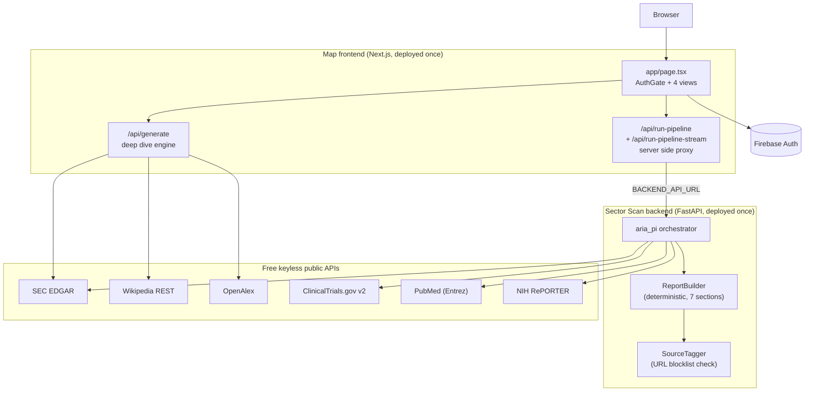
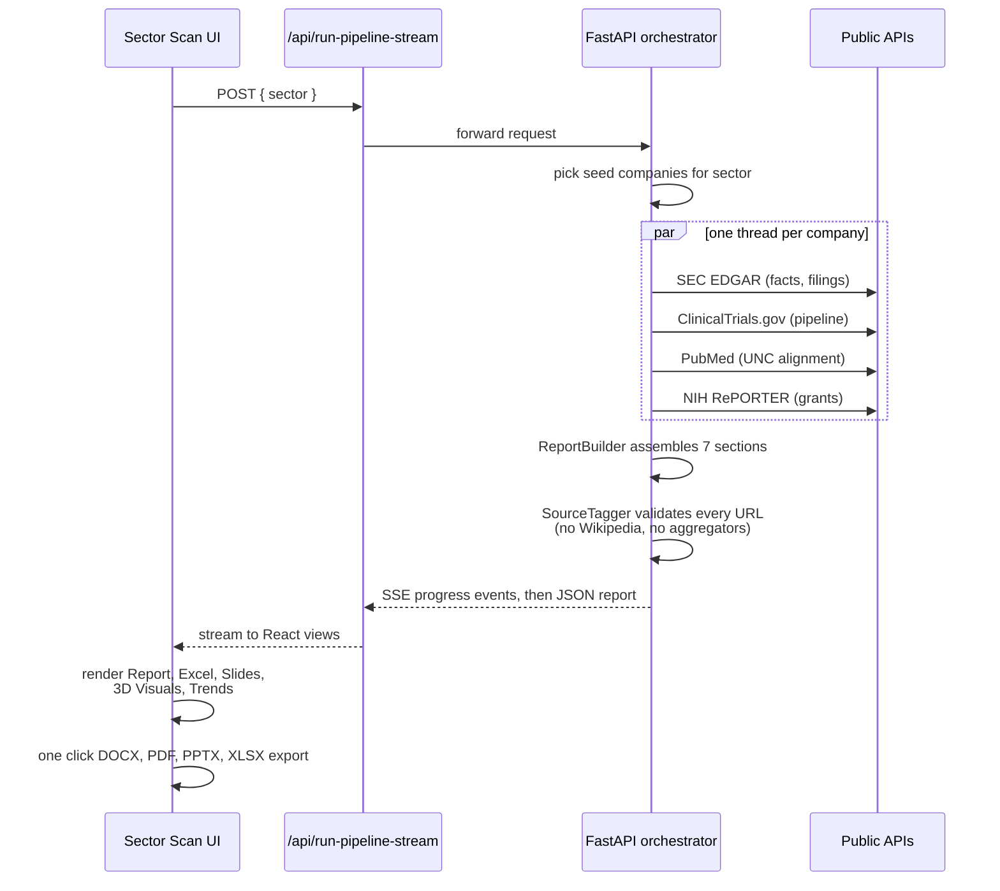
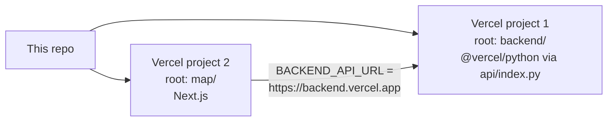

# Map

One web app. Two report engines. An accounts database. Zero per use cost.

Every number, sentence, and citation in a report traces to a free, keyless public data source. No language model sits in the request path. No API keys are required to run reports.

## What it does

| View | Route key | Purpose |
|---|---|---|
| Dashboard | `dashboard` | Launchpad. Links to every view, shows a live ticker grid. |
| Company Deep Dive | `company` | Full intelligence report on any public company. Live SEC EDGAR financials, 10-K narrative, leadership, streamed charts. |
| Sector Scan | `sector` | Maps public companies in a sector to overlapping research at UNC Chapel Hill. Scored, citation checked, exportable. |
| Accounts | `accounts` | Database of 142 partner accounts with researched, source cited profiles. Excel, PDF, and Markdown downloads. |

Sign in is handled by an auth gate on the landing page, backed by Firebase (email and password, Google, Microsoft OAuth).

## Architecture



Three facts to hold on to:

1. The deep dive engine runs inside the frontend. The `/api/generate` route streams a markdown report. Seven curated companies are served from `map/content/reports/*.md`. Any other public company is built live from SEC EDGAR (CIK lookup, XBRL financials, 10-K text, Form 4 executives), Wikipedia, and OpenAlex.
2. The sector scan splits front and back. The UI posts a sector to `/api/run-pipeline` (or the SSE variant for live progress). That Next.js route is a server side proxy that forwards to the Python backend named by one env var, `BACKEND_API_URL`. The proxy keeps the browser same origin (no CORS) and never caches, so each search is fresh.
3. Reports use no API keys. The orchestrator calls only keyless endpoints. SEC asks for a descriptive `User-Agent`, set in `map/lib/http.ts` and the Python clients. A legacy `claude_client.py` exists but is not on the pipeline path and falls back to a deterministic stub when no key is set.

## Sector scan pipeline



## Data sources

| Source | Used by | Provides | Key needed |
|---|---|---|---|
| SEC EDGAR (tickers, submissions, XBRL, archives) | both engines | financials, filings, 10-K text, Form 4 executives | No |
| Wikipedia REST | deep dive | narrative company overview | No |
| OpenAlex | deep dive | research output signals | No |
| ClinicalTrials.gov v2 | sector scan | company trial pipelines | No |
| PubMed (Entrez) | sector scan | UNC coauthorship and research alignment | No |
| NIH RePORTER | sector scan | grant funding signals | No |

## Repository layout

```
map/                              the merged app (Next.js)
  app/
    page.tsx                      AuthGate plus the 4 view workspace
    api/generate/                 deep dive report engine (runs in the frontend)
    api/run-pipeline/             proxy to Python backend (full report)
    api/run-pipeline-stream/      proxy to Python backend (SSE progress)
    components/                   deep dive components (charts, markdown, logo)
  components/
    AuthGate.tsx                  Firebase sign in gate
    workspace/                    dashboard, company, sector, accounts canvases
    Report.tsx, ExcelView.tsx,
    SlidesView.tsx, Chart3D.tsx,
    TrendsView.tsx, VisualsView.tsx
  lib/                            both engines' libraries plus accounts data
  content/reports/                7 hand curated company deep dives (markdown)
  src/                            standalone Firebase auth portal (login, account)
backend/                          Sector Scan FastAPI backend (Python, ARIA PI)
  api/index.py                    Vercel serverless entry point
  aria_pi/                        orchestrator, clients, builders, tests
ACCOUNTS_DATA.md                  enriched accounts database source document
company-intelligence-reports/     original program 1 (reference)
map-sector-scan-reports/          original program 2 (reference)
```

The two `*-reports` directories are the source programs the merge came from. They are kept for reference and are not deployed.

## Local development

Two terminals.

```bash
# 1. backend (Python 3.12 or newer)
cd backend
python3 -m venv .venv && .venv/bin/pip install -r requirements.txt
.venv/bin/uvicorn aria_pi.orchestrator:app --port 8000

# 2. frontend
cd map
npm install
BACKEND_API_URL=http://localhost:8000 npm run dev
# open http://localhost:3000
```

No API keys. `BACKEND_API_URL` is the only report related env var. Firebase sign in needs the usual Firebase web config (see `map/src/firebase/config.js`).

## Tests

```bash
cd backend
./run_tests.sh
```

The backend test suite covers every client (SEC EDGAR, ClinicalTrials.gov, PubMed, NIH RePORTER, web search), the report builder, the source tagger, sector seeds, the orchestrator, and the stage modules.

## Deployment

Deploy as two Vercel projects.



1. Backend. Deploy the `backend/` directory. Its `vercel.json` routes everything through `api/index.py`.
2. Frontend. Deploy the `map/` directory. Set one env var: `BACKEND_API_URL=https://<your backend>.vercel.app`.

Both fit on the free tier.

## Disclaimer

Independent project. Not created by, affiliated with, or endorsed by UNC Chapel Hill. For information only. Not investment advice.

## License

See [LICENSE](LICENSE).
