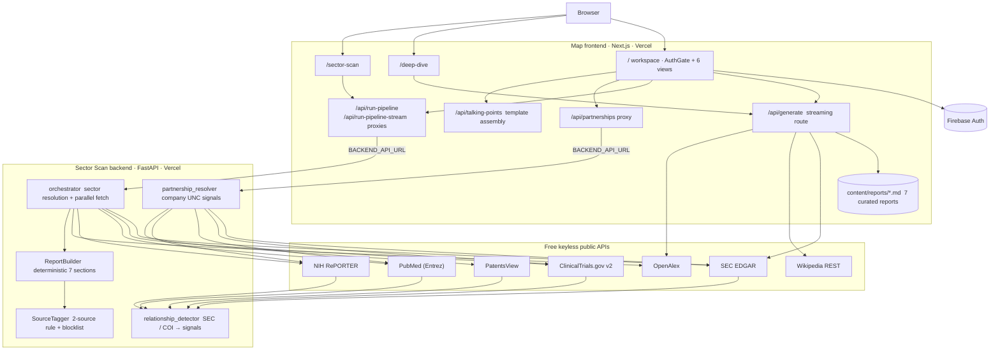
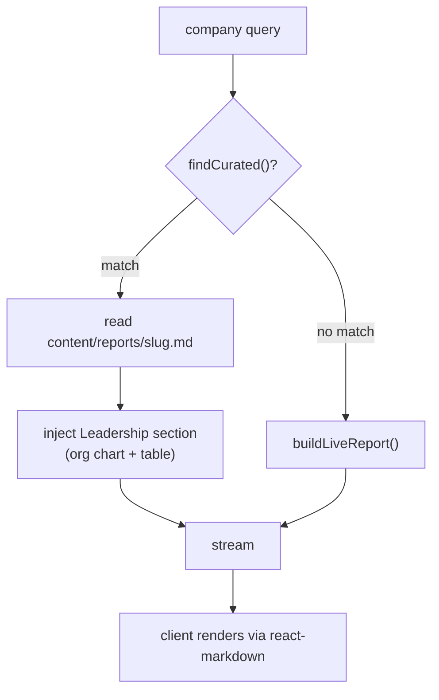
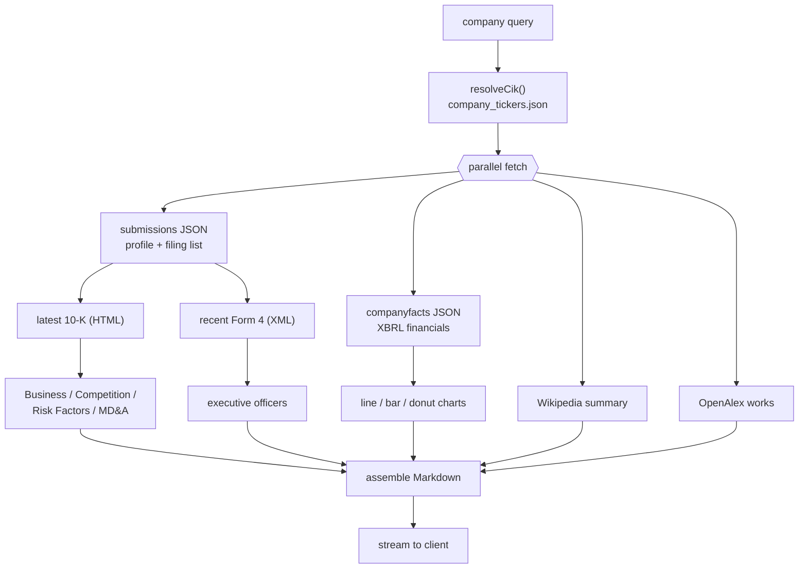
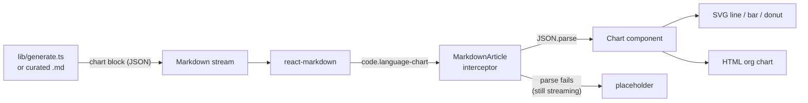
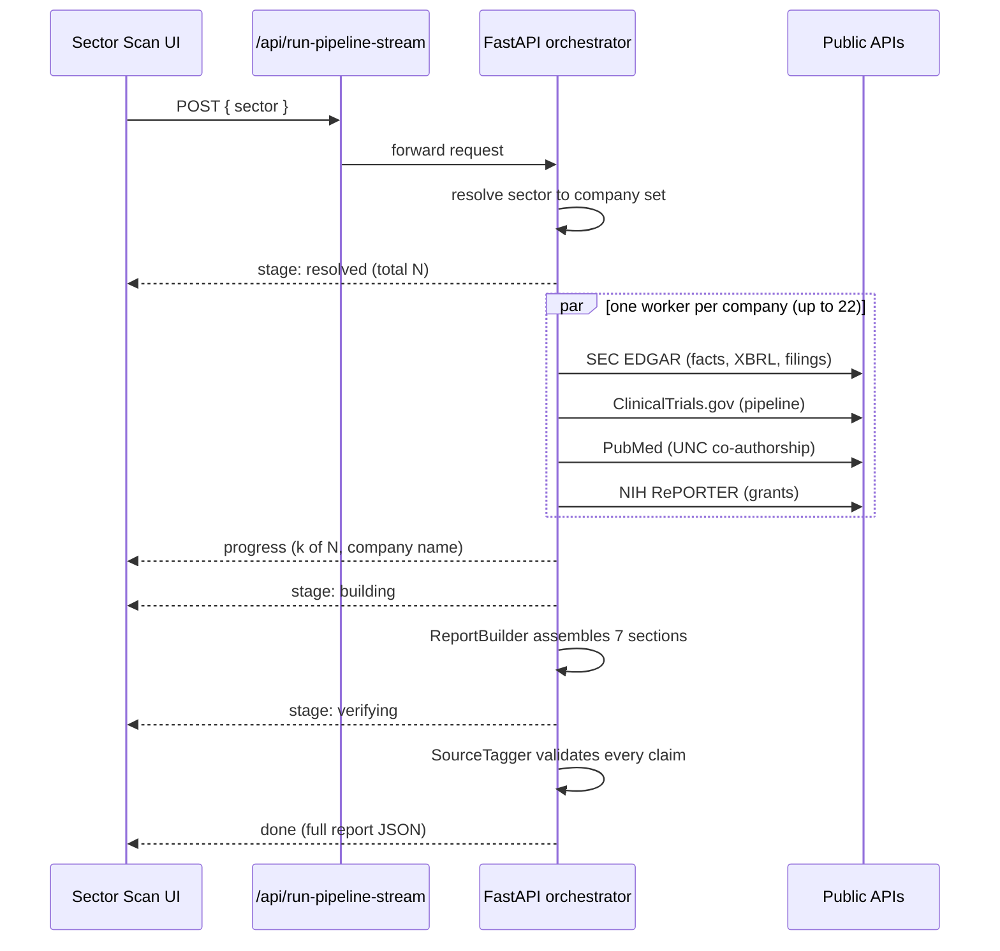
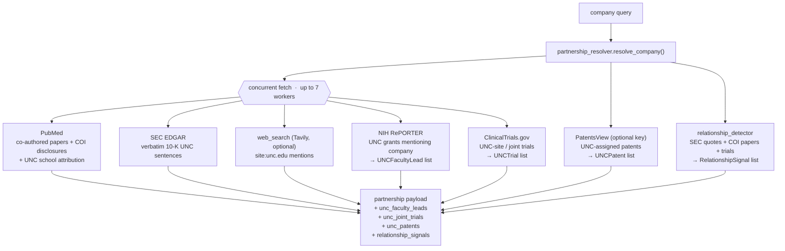
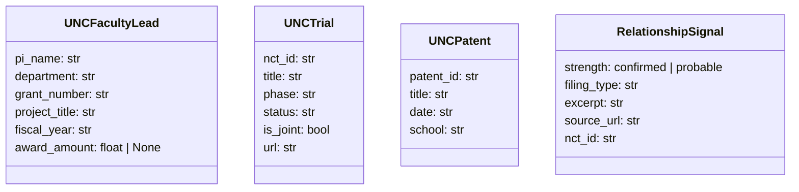
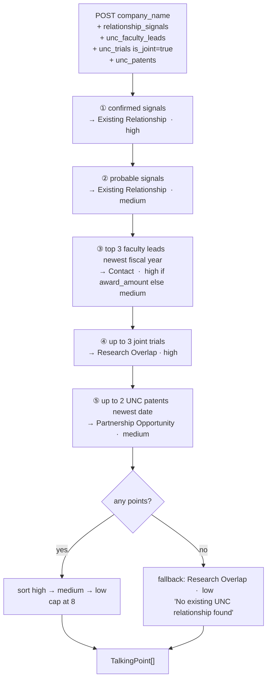
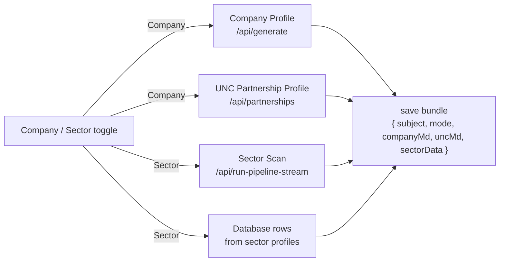
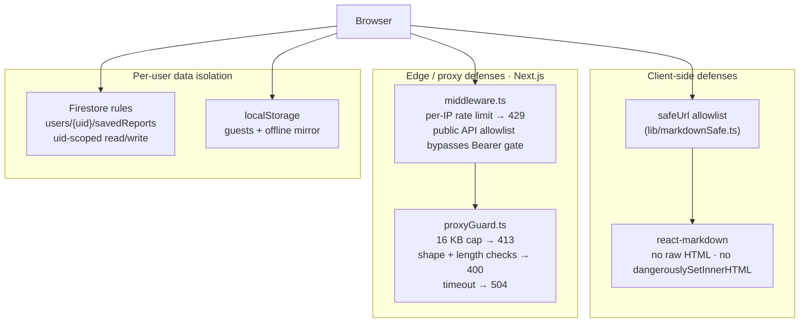

# Map

Map builds research reports on its own. One web app. Three engines. One login.

* **Company Profile** — a full report on any public company. Real SEC numbers, the firm's own 10-K words, leadership charts, and live graphs.
* **Sector Scan** — type an industry, get a sourced report in about a minute. It maps public companies to matching research at UNC Chapel Hill, scores them, and checks every citation.
* **UNC Partnership Intelligence** — for any company, it finds real UNC links: NIH grants, shared papers, joint trials, SEC filing mentions. Then it writes ready-to-send talking points.

The one rule behind every choice: **the app must be free to run.**

> No language model in the request path. No API keys needed. No cost per use.
> Every number, sentence, and citation comes from a free, public data source.

> **Disclaimer.** This is an independent project. It is not made by, tied to, or backed by UNC Chapel Hill. UNC is only the subject of the reports. For information only. Not investment advice.

## Table of contents

1. [What it does](#what-it-does)
2. [How it stays free](#how-it-stays-free)
3. [System architecture](#system-architecture)
4. [Engine 1: Company Profile](#engine-1-company-profile)
5. [Engine 2: Sector Scan](#engine-2-sector-scan)
6. [Engine 3: UNC Partnership Intelligence](#engine-3-unc-partnership-intelligence)
7. [Talking Points generator](#talking-points-generator)
8. [Projects canvas](#projects-canvas)
9. [Company database](#company-database)
10. [Authentication](#authentication)
11. [Security and privacy](#security-and-privacy)
12. [Data sources](#data-sources)
13. [Repository layout](#repository-layout)
14. [Local development](#local-development)
15. [Environment variables](#environment-variables)
16. [Deployment](#deployment)
17. [Performance and limits](#performance-and-limits)
18. [Data integrity rules](#data-integrity-rules)
19. [Limitations](#limitations)
20. [License](#license)

## What it does

The app has three surfaces.

**The workspace at `/`** sits behind a login. It shows six views in one top nav:

| View | What it shows |
|---|---|
| Dashboard | The home screen. One search box and a 3D orbit. Type a name, press enter, and it opens a Project that runs the full pipeline. |
| Company | A Company Profile card. Search any public company. The report streams in. |
| Sector | A Sector Scan card. Live progress ("N of M companies"), a ticker grid, and the full report. Click a ticker to load that company in the Company view. |
| Partnerships | UNC Partnership Intelligence. Toggle company or sector. Shows real UNC signals plus a Talking Points card. |
| Companies | The company database as a live table. Search, filter, sort, and export to CSV / Excel / PDF / Markdown. |
| Projects | Saves one full pipeline run as a project. See [Projects canvas](#projects-canvas). |

**The standalone pages** hold the two original apps in full:

| Route | What it is |
|---|---|
| `/deep-dive` | The full Company Profile app: search, a streaming reader, a table of contents, and an intro splash. |
| `/sector-scan` | The full Sector Scan workspace with five views: Report, Visualize, Trends, Excel, Slide Deck. |

## How it stays free

A normal "AI report tool" calls a language model. That costs money and needs a key. Map drops the model and uses three ideas instead:

1. **Curated reports.** Seven big companies (Apple, NVIDIA, Microsoft, Alphabet, AWS, Anthropic, OpenAI) are hand-written profiles. They use real SEC numbers and live as Markdown in the repo. They load at once with no network calls.
2. **Live reports.** Any other company, and every sector scan, is built on demand from free public APIs (SEC EDGAR, Wikipedia, OpenAlex, ClinicalTrials.gov, PubMed, NIH RePORTER). No model. The profile narrative is the company's *own* words, taken from its latest 10-K.
3. **Deterministic talking points.** The talking-points step is template assembly from data. No model. No key. No cost. It reads the partnership evidence already on hand and writes up to 8 ranked points.

No language model runs anywhere in the request path. No Anthropic or OpenAI key is used or set.

## System architecture

Two parts ship on their own to Vercel: a Next.js frontend and a FastAPI backend. They talk over one env var, `BACKEND_API_URL`.



* **Frontend** (`map/`): the Next.js app. The company profile, partnership lookup, and talking-points steps all run *inside* it as API routes. The `/api/run-pipeline*` and `/api/partnerships` routes are server-side proxies, so the browser never calls the backend on its own.
* **Backend** (`backend/`): FastAPI on the `@vercel/python` runtime. It resolves sectors, fans out to public APIs, builds the report, and finds company UNC links.

## Engine 1: Company Profile

### The two report paths



`findCurated()` (in `map/lib/registry.ts`) cleans the query and checks it against each curated company's slug, name, ticker, and aliases. So `AAPL`, `apple`, and `Apple Inc.` all hit the Apple report. `claude` hits Anthropic. `chatgpt` hits OpenAI.

### Live report assembly

For any other company, `buildLiveReport()` fans out to every free source at once, then builds the report section by section.



The report holds: Executive Summary, Company Overview, Strategic Direction (10-K Business), Business Model and Financials (tables and charts), Competitive Positioning, Key Risks, Recent SEC Filings, Research Signals, Outlook (MD&A), Leadership (org chart), and Sources.

### 10-K narrative extraction

The narrative sections are the company's own words, pulled from its newest 10-K. `sliceItems()` finds every `Item N` marker and keeps the longest block per item. `htmlToText()` strips tags, decodes HTML entities, and keeps block breaks. `excerpt()` trims to a full sentence and cleans the Markdown. `riskHeadlines()` pulls short risk lines.

### Executive extraction (Form 4)

Leadership for live companies comes from SEC Form 4 filings. Their raw XML lists each owner's name and officer title. That is far cleaner than parsing the 10-K officer table. The pipeline takes 10 recent Form 4 filings, fixes name order and title case, ranks by rank, drops dupes, and keeps the top 6.

### Financial data (XBRL)

`fetchFinancials()` reads the SEC's XBRL company facts and builds clean yearly series. `mergedAnnual()` fills each year from the best concept that reports it. The result is a steady multi-year series for revenue, gross profit, operating income, net income, R&D, assets, liabilities, equity, and buybacks.

### The chart system

Charts have no dependencies. They are hand-built SVG (line, bar, pie, donut) and HTML (org chart). They ride *inside the Markdown* as fenced `chart` code blocks that carry a JSON spec, caught at render time.



While a chart block is still streaming (the JSON is not done), the interceptor shows a placeholder. Once the closing fence lands, it parses and draws.

## Engine 2: Sector Scan

Give it a sector (say `Oncology`, `Semiconductors`, or `Energy Minerals`). The backend then:

1. Resolves the sector to a company set: 39 curated sectors, or live SEC EDGAR full-text search for niche terms.
2. Pulls primary-source data per company, in parallel, from SEC EDGAR, ClinicalTrials.gov, PubMed, and NIH RePORTER.
3. Builds a 7-section report plus a one-page summary. Every claim has at least two citable URLs.
4. Streams real progress to the browser as each company resolves.



If streaming is not available, the frontend falls back to a plain `/run-pipeline` request with a cosmetic progress bar.

### Report structure

| # | Section | Highlights |
|---|---|---|
| Summary | Executive brief | metric tiles, thesis, pie charts, SEC snapshot, NC context, UNC units |
| 1 | Sector Overview | definition, scale, why now, NC context, UNC units; revenue and R&D charts |
| 2 | Internal Mapping | known partnerships, faculty, data assets, risk flags; alignment chart |
| 3 | Company Selection | selected vs excluded; UNC tie and partnership scale pie charts |
| 4 | Company Profiles | per-company facts, filings, pipeline, partnering, UNC alignment, signals (up to 22) |
| 5 | Value Proposition | data assets, research capacity, talent, NC access, models |
| 6 | Talking Points | sourced per-company outreach points |
| 7 | References | AMA style, deduped, numbered, plus a verification checklist |

### The five-view workspace (`/sector-scan`)

| View | What it shows | Export |
|---|---|---|
| Report | 7-section report + one-page summary, inline AMA citations, scroll-spy TOC | Markdown, PDF, Word |
| Visualize | 23 charts led by a 3D connection orbit (companies circling a UNC node), 3D scatter, Sankey flow, correlation matrix, Lorenz curve, Pareto, radar, heatmap | PDF / Word |
| Trends | 10-year SEC financial paths (revenue, R&D, net income) with CAGR and momentum | — |
| Excel | 18-sheet workbook (HHI, correlation, quartiles, CAGR, priority scores) | `.xlsx` |
| Slide Deck | A per-sector deck with speaker notes | `.pptx` |

## Engine 3: UNC Partnership Intelligence

The UNC panel answers two questions: *Is this company already a UNC partner?* and *If not, why should they be?* Every fact ties to a primary source.

### Data pipeline



### What the frontend renders

After each company search, the panel shows tiers of evidence:

| Card | Source | Signal type |
|---|---|---|
| Partner Status Banner | all sources | depth: Active / Exploratory / None confirmed |
| UNC Research Contacts | NIH RePORTER grants | named PIs + departments |
| Active Programs | ClinicalTrials.gov | UNC-site trials, phase, status |
| UNC Units | PubMed affiliation | schools with paper counts |
| Clinical / Research | PubMed co-authorship | papers with PMIDs |
| Financial / Legal | SEC EDGAR 10-K | verbatim UNC sentences |
| University Ecosystem | web search | official unc.edu mentions |
| **Talking Points** | all above | ranked outreach points |

A downloadable Markdown report bundles all the evidence. It exports the same way as the Company Profile (PDF, DOCX, Markdown).

### Signal shapes



## Talking Points generator

`/api/talking-points` is a deterministic POST route. No model. No key. No cost. It takes the partnership payload already fetched and builds up to 8 `TalkingPoint` rows, sorted by strength.

### Assembly rules



### TalkingPoint schema

```typescript
interface TalkingPoint {
  category: "Research Overlap" | "Existing Relationship" | "Partnership Opportunity" | "Contact";
  headline: string;   // one sentence, max 120 chars
  detail:   string;   // evidence + source, max 200 chars
  strength: "high" | "medium" | "low";
}
```

### Talking Points card

In the UNC panel, the card sits below "Why UNC" after each search. While the fetch is in flight, three shimmer rows show.

| Element | Behavior |
|---|---|
| Strength pill | Green (High) · Yellow (Medium) · Muted (Low) |
| Category label | Small muted uppercase above the headline |
| Headline | Bold, full width |
| Detail | Muted small text; URLs become "View source →" links |
| "Copy all as text" | Copies every point as `[Category] Headline\n→ Detail` — paste it into an email |

## Projects canvas

The Projects canvas saves one full pipeline run as a named project. It stores to Firebase and reopens with no re-fetch.

### Mode toggle



In **Company** mode, the Sector Scan and Database panels say `"Run a Sector scan to populate…"`. In **Sector** mode, the Company Profile and UNC Partnership panels say `"Run a Company search to populate…"`. Reopening a saved run restores the toggle, all Markdown, and the sector data, with no re-fetch.

### Save / reopen flow


## Company database

The Companies view renders 309 companies parsed from the UNC industry company load template and enriched by research. Each profile carries aliases, parent account, sector profiles, a description, structure, ownership, address, founded year, employees, revenue, and a login-gated link to the source report.

It renders as a live table: search by name / sector / HQ, type-filter pills (Public / Private / Nonprofit / Government), click-to-sort columns, structure pills, exchange tags, and a pinned first column. Downloads: CSV of the filtered set, plus `.xlsx`, landscape PDF, and raw Markdown.

* Data lives in `map/components/workspace/accountsData.ts`. Full citations live in `ACCOUNTS_DATA.md`.
* Dupes across the source sets are merged by `getUniqueAccounts()`.

## Authentication

The workspace at `/` sits behind `AuthGate` (Firebase): email/password, Google, and Microsoft OAuth. The reports need no auth and no keys. The gate only covers the workspace UI. A standalone auth portal (login page plus account dashboard, React Router) lives under `map/src/`.

## Security and privacy

The free, keyless, public-source design shapes the threat model. There are no paid keys to leak, no model in the path, and no private data beyond what a user chooses to save.



### What is hardened

* **Markdown XSS.** `react-markdown` renders with no raw-HTML pass. Every link and image URL goes through `safeUrl` (`map/lib/markdownSafe.ts`). It strips control-character tricks, then allows only `http(s):`, `mailto:`, in-page anchors, and same-origin paths.
* **Public API allowlist.** `middleware.ts` keeps an explicit `PUBLIC_API` list (`/api/generate`, `/api/partnerships`, `/api/talking-points`, `/api/run-pipeline`, `/api/freshness`). Routes off this list need a Bearer token.
* **Rate limits.** Per-IP, per-route caps (`lib/rateLimit.ts`): `/api/generate` 10/min, `/api/run-pipeline*` 3/min, `/api/partnerships` 20/min. Over the cap returns 429.
* **Proxy abuse.** `proxyGuard.ts` checks before any upstream work: 16 KB body cap, JSON shape and length checks, fetch timeout, `no-store` cache headers.
* **No secrets in the path.** No keys are required or committed. The optional `TAVILY_API_KEY` and `PATENTSVIEW_API_KEY` only add web-search and patent data; both default off.
* **Security headers.** Every response carries CSP (`default-src 'self'`, `object-src 'none'`, `frame-ancestors 'self'`), HSTS, `X-Frame-Options: SAMEORIGIN`, `X-Content-Type-Options: nosniff`, `Referrer-Policy: strict-origin-when-cross-origin`, and a `Permissions-Policy` that turns off camera/mic/geolocation.
* **Per-user data isolation.** Saved reports for signed-in users live at `users/{uid}/savedReports/{id}` in Firestore, locked by rules that need `request.auth.uid == userId`.

### Honest limitations

* The auth gate is client-side. The public proxy and `/api/generate` routes are open by design.
* Client-side name leakage. Logos come from Clearbit/DuckDuckGo/Google favicon endpoints. Executive names go to `ui-avatars.com`. Both over HTTPS.
* Rate limiting is per-instance. The limiter is in-memory per serverless instance.
* The CSP keeps `'unsafe-inline'`. A nonce-based policy would be stronger.
* Firestore rules must be deployed to Firebase to take effect.

## Data sources

All free. All primary source. No API keys required.

| Source | Used by | Provides | Endpoint |
|---|---|---|---|
| SEC ticker DB | company profile | name/ticker → CIK | `sec.gov/files/company_tickers.json` |
| SEC submissions | both | HQ, industry, exchange, filing history | `data.sec.gov/submissions/` |
| SEC company facts | both | multi-year XBRL financials | `data.sec.gov/api/xbrl/companyfacts/` |
| SEC archives | both | 10-K (HTML), Form 4 (XML), DEF 14A | `sec.gov/Archives/edgar/data/` |
| SEC full-text search | sector scan | live sector discovery | `efts.sec.gov` |
| Wikipedia REST | company profile | narrative overview | `en.wikipedia.org/api/rest_v1/` |
| OpenAlex | both | recent research output | `api.openalex.org/works` |
| ClinicalTrials.gov v2 | sector scan + UNC | sponsor-matched trials, phases, UNC-site detection | `clinicaltrials.gov/api/v2/studies` |
| PubMed (Entrez) | sector scan + UNC | UNC co-authored papers, COI disclosures | `eutils.ncbi.nlm.nih.gov` |
| NIH RePORTER | sector scan + UNC | UNC grants mentioning a company, PI contacts | `api.reporter.nih.gov/v2/projects/search` |
| PatentsView | UNC partnership | UNC-assigned patents (optional key) | `search.patentsview.org/api/v1/patent/` |
| Tavily | UNC partnership | site:unc.edu web mentions (optional key; mock fallback) | `tavily.com` |
| ui-avatars | company profile (client) | executive initial avatars | `ui-avatars.com` |
| Favicons | company profile (client) | company logos with fallback chain | Clearbit / DuckDuckGo / Google |

## Repository layout

```
map/                                  Next.js app  ·  one Vercel project
  app/
    page.tsx                          AuthGate + 6-view workspace
    deep-dive/page.tsx                standalone Company Profile app
    sector-scan/page.tsx              standalone 5-view Sector Scan workspace
    api/generate/route.ts             company profile streaming route (curated vs live)
    api/partnerships/route.ts         UNC partnership proxy → FastAPI backend
    api/talking-points/route.ts       deterministic talking-points assembler (no model)
    api/run-pipeline/route.ts         JSON proxy → backend
    api/run-pipeline-stream/route.ts  SSE proxy → backend
    api/freshness/route.ts            data freshness check
    components/                       MarkdownArticle (chart interceptor), Charts,
                                      CompanyLogo, IntroSplash
  components/
    AuthGate.tsx                      Firebase sign-in gate
    workspace/
      DashboardHome.tsx               home view
      CompanyCanvas.tsx               Company Profile card
      SectorCanvas.tsx                Sector Scan card
      PartnershipsView.tsx            UNC Partnership Intelligence view
                                        · PartnerData type (UNCFacultyLead,
                                          UNCTrial, UNCPatent, RelationshipSignal)
                                        · Talking Points card with clipboard copy
      ProjectsCanvas.tsx              Projects canvas · Company / Sector toggle
                                        · RunBundle save / reopen
      AccountsCanvas.tsx              Companies database view
      InteractiveAccountsTable.tsx    live search + filter + sort + export
      accountsData.ts                 309-company database
    Report.tsx                        sector report renderer, charts, TOC, summary
    VisualsView.tsx                   23 charts + diagrams
    TrendsView.tsx                    10-year SEC financial paths
    ExcelView.tsx / SlidesView.tsx    workbook and deck views
    Chart3D.tsx                       3D orbit + isometric scatter (SVG)
  lib/
    registry.ts / curated.ts          curated company list, resolver, C-suite
    generate.ts                       live company profile assembler
    sec.ts                            EDGAR: CIK, profile, XBRL, 10-K, Form 4
    wikipedia.ts / openalex.ts
    charts.ts / leadership.ts         chart block builders, leadership section
    report-analytics.ts               HHI, correlation, quartiles, scores
    report-excel.ts                   18-sheet .xlsx builder
    report-slides.ts                  per-sector .pptx deck + speaker notes
    report-export.ts / pdf-writer.ts  Markdown / PDF / Word exporters
    markdownSafe.ts                   safeUrl link/image allowlist
    proxyGuard.ts / rateLimit.ts      proxy body checks, per-route rate limits
    verifyAuth.ts                     optional Firebase token check (null for guests)
  middleware.ts                       edge middleware · public API allowlist · rate limit
  content/reports/*.md                7 curated company profiles
  src/                                standalone Firebase auth portal
  tests/
    unit/                             Vitest: markdownSafe, format, sec
    e2e/                              Playwright: partnerships, talking-points,
                                        company-profile, sector-package, security, smoke

backend/                             Sector Scan + UNC Partnership · FastAPI · Vercel
  api/index.py                       Vercel ASGI entry point
  vercel.json                        @vercel/python · maxDuration 60
  aria_pi/
    orchestrator.py                  FastAPI app, endpoints, concurrency, SSE
    sectors.py                       sector resolution, 39 curated + NC seeds
    config.py                        defaults (companies_per_report = 22)
    clients/
      sec_edgar_client.py            SEC verbatim quote extraction
      clinicaltrials_client.py       sponsor-matched trials + UNCTrial list
      pubmed_client.py               co-authored papers + COI disclosures
      nih_reporter_client.py         NIH grants + UNCFacultyLead list
      openalex_client.py             UNC research works
      patents.py                     patents + UNCPatent list (PatentsView)
      web_search_client.py           site:unc.edu mentions (Tavily, optional)
      partnership_resolver.py        fan-out orchestrator → partnership payload
      partnership_fit.py             sector-fit scoring
      relationship_detector.py       SEC quotes + COI → RelationshipSignal list
    builders/report_builder.py       deterministic 7-section report assembly
    stages/                          company_profiler, verification
    utils/source_tagger.py           2-source validation + blocklist
    utils/                           affiliation, name_resolver, net_guard
    models/                          Pydantic models (claim, company, profile)
    data/                            curated UNC data (unc_programs.json, seeds)
    tests/                           pytest suite (16 files)

ACCOUNTS_DATA.md                     accounts database citations
company-intelligence-reports/        original program 1 (reference, not deployed)
map-sector-scan-reports/             original program 2 (reference, not deployed)
```

Tech stack: Next.js 15 (App Router), React 19, TypeScript 5, Tailwind; FastAPI, Pydantic, Python 3; exports via `docx`, `jspdf`, `xlsx` (SheetJS), `pptxgenjs`; Firebase 12 for auth; Vercel for both runtimes.

## Local development

Two services, two terminals.

```bash
# 1. backend (Python 3.11 or newer)
cd backend
python3 -m venv .venv && source .venv/bin/activate
pip install -r requirements.txt
uvicorn aria_pi.orchestrator:app --reload --port 8000
# http://localhost:8000/status

# 2. frontend
cd map
npm install
echo 'BACKEND_API_URL=http://localhost:8000' > .env.local
npm run dev
# http://localhost:3000
```

Tests:

```bash
# backend (pytest)
cd backend && ./run_tests.sh   # or: pytest

# frontend
cd map
npm run test:unit              # Vitest unit tests (markdownSafe, format, sec)
npm test                       # Playwright e2e (fully mocked, runs offline)
npm run typecheck              # tsc --noEmit
```

The backend suite covers every client, the report builder, the source tagger, sector resolution, the orchestrator, the stages, and security. The frontend has Vitest unit tests for pure functions and Playwright e2e specs that mock every API, so they run offline and the same way each time.

## Environment variables

**Frontend** (server-side only):

| Variable | Required | Description |
|---|---|---|
| `BACKEND_API_URL` | No | Backend base URL for the sector scan and partnership proxies. Defaults to the live API alias. |
| `VERCEL_AUTOMATION_BYPASS_SECRET` | No | Set only if the backend project has Deployment Protection on. |
| `NEXT_PUBLIC_FIREBASE_*` | No | Firebase web config. Checked in by default. |
| `FIREBASE_SERVICE_ACCOUNT` | No | Enables server-side Firebase token checks. |

**Backend:**

| Variable | Required | Description |
|---|---|---|
| `PATENTSVIEW_API_KEY` | No | Turns on UNC patent lookups. Omitted = no patent data (safe zero default). |
| `TAVILY_API_KEY` | No | Turns on real web search for unc.edu mentions. Omitted = free mock search. |

The company profile and talking-points engines need no env vars at all. No model key is used anywhere.

## Deployment

Two Vercel projects, both on the free tier.


```bash
cd backend && npx vercel --prod
cd map     && npx vercel --prod
```

Set `BACKEND_API_URL` on the frontend project to the backend's URL. Curated Markdown files are bundled into the serverless function via `outputFileTracingIncludes`.

## Performance and limits

* **Concurrency budget.** Up to 22 companies are fetched in parallel under a hard 44-second budget, so the backend stays under Vercel's 60-second cap.
* **Streaming cadence.** Company profile reports stream in small chunks. Sector scan progress events fire as each company resolves.
* **Talking points latency.** `/api/talking-points` does zero network calls. It is pure in-process assembly and returns in a few milliseconds.
* **Export size.** PDF and Word capture the rendered page as paginated images, so big sector reports can run 70–95 pages and take ~20 seconds. Markdown, Excel, and PowerPoint come from data and stay small.
* **Mobile.** The UI is responsive. Image-based PDF/Word capture is memory-heavy. On mobile, prefer Markdown / Excel / PowerPoint.

## Data integrity rules

* **Two-source rule.** Every sector scan claim needs at least two independent citable URLs, or it is flagged for review.
* **Source blocklist.** Wikipedia, aggregators, and unattributed news are rejected as citations. SEC, ClinicalTrials.gov, PubMed, NIH RePORTER, and peer-reviewed journals are accepted.
* **Sponsor matching.** Clinical trials are matched on sponsor and collaborator fields, not free text. Unrelated trials are never tied to a company.
* **Own words only.** Company profile narrative comes from the company's filings, not generated prose.
* **Talking points are deterministic.** The assembler emits only what the evidence supports. It never invents headlines or details.

## Limitations

These follow from the no-paid-APIs rule, and the UI is honest about them:

* Private companies (no SEC filings) get lighter profiles.
* LinkedIn links are prefilled search URLs, not exact profiles.
* Executive avatars are generated initials, not photos.
* UNC alumni detection reads DEF 14A proxy statements and public leadership pages. It covers board members and named executives, not every employee.
* Live profile narrative is the company's own 10-K text, not original analysis. That is the one thing a model would add.
* Patent data needs a free PatentsView key. Without one, the UNCPatent list is empty.
* Web mentions need a free Tavily key. Without one, search falls back to a mock.
* Reports are drafts for human review before any outreach. The tool removes the grunt work. It does not replace analyst judgment.

## License

MIT. See [LICENSE](LICENSE).

Data: U.S. SEC EDGAR, Wikipedia, OpenAlex, ClinicalTrials.gov, PubMed, NIH RePORTER, PatentsView. For information only. Not investment advice.
</content>
</invoke>
