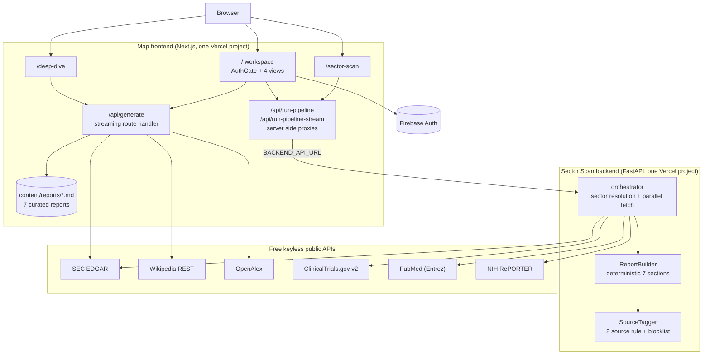
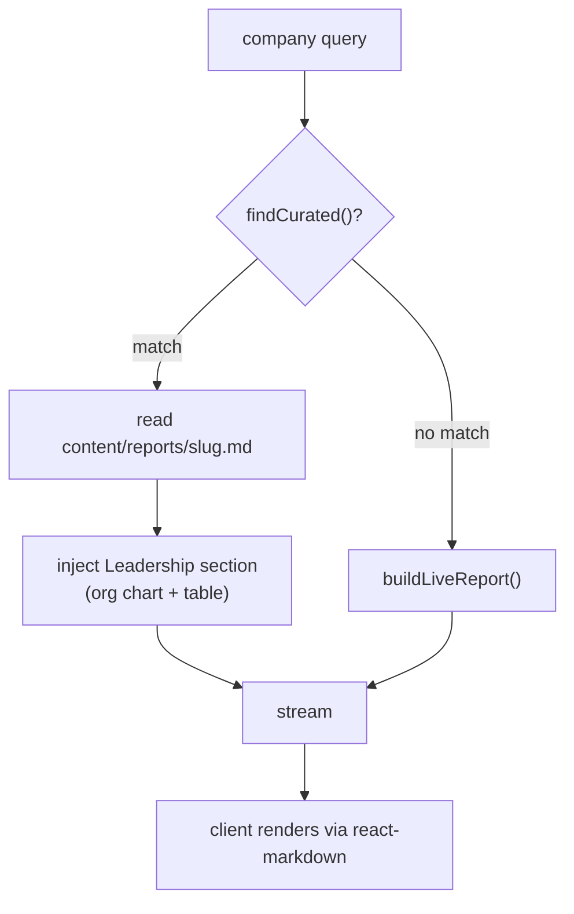
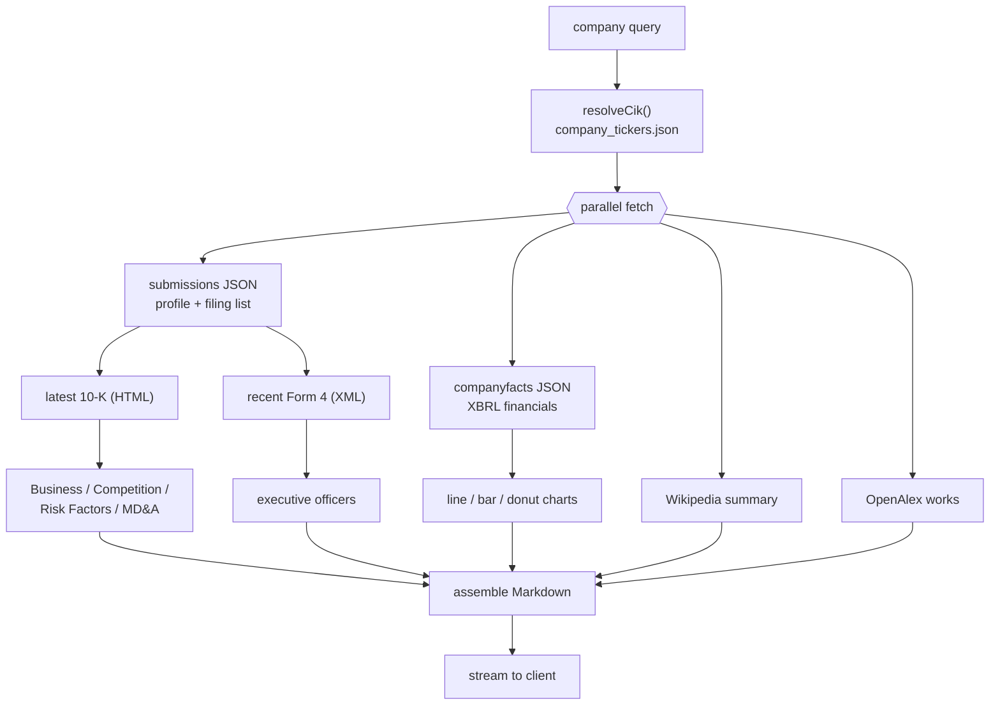
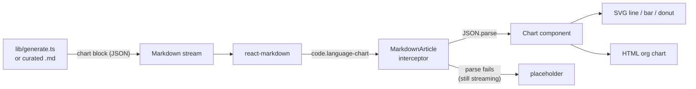
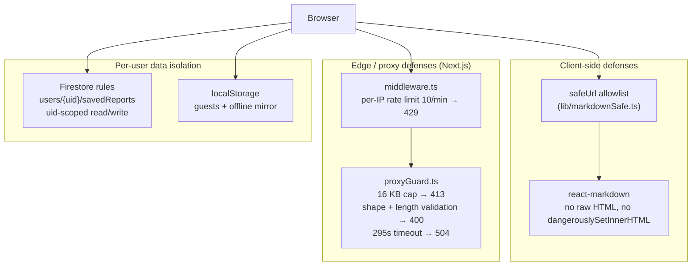
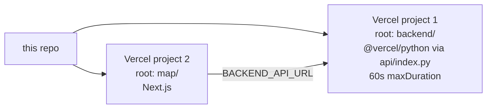

# Map

One web app with two report engines behind a single sign in.

* **Company Profile**: board ready intelligence reports on any public company. Full financial statements, narrative lifted from the company's own SEC filings, leadership org charts, streamed charts.
* **Sector Scan** (from *map / ARIA PI*): partnership intelligence for university technology transfer. Type a sector, get a fully sourced report mapping public companies to overlapping research at UNC Chapel Hill, scored and citation checked, in about a minute.

The hard constraint behind every design decision in both engines: **completely free to run.**

> No language model in the request path. No API keys. No per use cost.
> Every number, sentence, and citation traces to a free, keyless public data source.

> **Disclaimer.** Independent project. Not created by, affiliated with, or endorsed by UNC Chapel Hill or any of its offices. UNC appears only as the analytical subject of the reports the tool generates. For information only. Not investment advice.

## Table of contents

1. [What it does](#what-it-does)
2. [How it stays free](#how-it-stays-free)
3. [System architecture](#system-architecture)
4. [Engine 1: Company Profile](#engine-1-company-profile)
5. [Engine 2: Sector Scan](#engine-2-sector-scan)
6. [Company database](#company-database)
7. [Authentication](#authentication)
8. [Security and privacy](#security-and-privacy)
9. [Data sources](#data-sources)
10. [Repository layout](#repository-layout)
11. [Local development](#local-development)
12. [Environment variables](#environment-variables)
13. [Deployment](#deployment)
14. [Performance and limits](#performance-and-limits)
15. [Data integrity rules](#data-integrity-rules)
16. [Limitations](#limitations)
17. [License](#license)

## What it does

The app has three surfaces.

**The workspace at `/`** sits behind an auth gate and exposes four views from one top nav:

| View | What it shows |
|---|---|
| Dashboard | Launchpad. Editorial hero, a search bar with a Company/Sector toggle that runs either engine, a rotating 3D orbit, and an "Open a Canvas" card. |
| Company | Company Profile embedded as a canvas card. Search any public company, the report streams in. |
| Sector | Sector Scan embedded as a canvas card. Live progress ("N of M companies"), ticker grid, full report. Clicking a ticker cross loads that company into the Company view. |
| Database | The company database (154 companies) as an interactive table: live search, type filters (Public / Private / Nonprofit / Government), sortable columns, structure pills, and CSV / Excel / PDF / Markdown export. |

**The standalone pages** carry the two source apps over whole:

| Route | What it is |
|---|---|
| `/deep-dive` | The full Company Profile app: search, streaming markdown reader, table of contents, intro splash. |
| `/sector-scan` | The full Sector Scan workspace with five views over one generated report: Report, Visualize, Trends, Excel, Slide Deck. |

## How it stays free

A normal "AI report generator" calls an LLM, which costs money and needs a key. Map replaces the LLM with two ideas:

1. **Curated reports.** Seven marquee companies (Apple, NVIDIA, Microsoft, Alphabet, AWS, Anthropic, OpenAI) are hand written company profiles, grounded in real SEC numbers and stored as Markdown in the repo. They render instantly with zero network calls.
2. **Live reports.** Any other public company, and every sector scan, is assembled on demand from free, keyless public APIs (SEC EDGAR, Wikipedia, OpenAlex, ClinicalTrials.gov, PubMed, NIH RePORTER). No synthesis model. The company profile narrative is the company's *own* words, lifted from its latest 10-K. The sector report is assembled deterministically by `ReportBuilder`.

The only "AI shaped" thing missing is original prose for arbitrary companies, which is exactly the part that is not free. Everything else (financials, risk factors, strategy, competition, leadership, trials, grants, charts) is real public data, rendered well.

A legacy `claude_client.py` exists in the backend but is not on the pipeline path; it falls back to a deterministic stub when no key is set. No key is required or set anywhere.

## System architecture



Two independently deployed Vercel projects:

* **Frontend** (`map/`): the Next.js app. The company profile engine runs *inside* it as the `/api/generate` streaming route handler, calling only public APIs and streaming Markdown back in roughly 220 character chunks so the report renders progressively. The `/api/run-pipeline` and `/api/run-pipeline-stream` routes are server side proxies to the backend, so the browser never calls it directly (same origin, no CORS) and no stale cache is served.
* **Backend** (`backend/`): FastAPI on the `@vercel/python` runtime. Resolves the company set for a sector, fans out to the four public data APIs concurrently within a hard time budget, and assembles the report deterministically.

The frontend to backend connection is one env var, `BACKEND_API_URL`. Nothing else is shared.

## Engine 1: Company Profile

### The two report paths



`findCurated()` (in `map/lib/registry.ts`) normalizes the query (lowercase, strip punctuation) and matches it against each curated company's slug, name, ticker, and aliases. So `AAPL`, `apple`, and `Apple Inc.` all resolve to the curated Apple report, `claude` resolves to Anthropic, and `chatgpt` resolves to OpenAI.

### Live report assembly

For a non curated company, `buildLiveReport()` (in `map/lib/generate.ts`) fans out to every free source in parallel, then assembles the report section by section.



The assembled report contains: Executive Summary, Company Overview, Strategic Direction (10-K Business), Business Model and Financials (tables and charts), Competitive Positioning (10-K Competition), Key Risks (10-K risk factors), Recent SEC Filings, Research Signals, Outlook (10-K MD&A), Leadership (org chart), Sources.

### 10-K narrative extraction

The narrative sections are the company's own words, parsed from the most recent 10-K. This is where most of the engineering lives (`map/lib/sec.ts`), because 10-K HTML is large and inconsistent.

* `sliceItems()` indexes every `Item N` marker and keeps the *longest* block per item: the real section, not the table of contents line that repeats the same heading.
* `htmlToText()` strips tags, decodes numeric HTML entities (`&#8217;` becomes an apostrophe) so smart quotes render correctly, and preserves block boundaries as newlines so headers stay on their own lines.
* `excerpt()` trims to a sentence boundary and sanitizes Markdown (escaping `*` and `_`, stripping brackets) so raw filing text can never break the rendered report.
* `riskHeadlines()` heuristically pulls the short bold style risk category lines (for example Tesla's "Risks Related to Our Operations").

### Executive extraction (Form 4)

Leadership for live companies comes from SEC Form 4 filings (insider transactions), whose raw XML carries each reporting owner's name and officer title. That is far more reliable than parsing the 10-K's officer table.

The pipeline picks 10 recent Form 4 filings, parses `rptOwnerName`, `officerTitle`, and `isOfficer`, reorders names from `Last First Middle [Suffix]` to natural order with suffix awareness (`Ford William Clay Jr` becomes `William Clay Ford Jr`), normalizes title casing (`PRESIDENT &amp; CEO` becomes `President & CEO`), ranks by seniority, dedupes, and keeps the top 6 for the org chart. Curated companies use a hand verified C suite instead.

### Financial data (XBRL)

`fetchFinancials()` reads the SEC's XBRL company facts and builds clean annual series. Companies re tag the same line item over time (for example `Revenues` becomes `RevenueFromContractWithCustomerExcludingAssessedTax`), so a single concept leaves gaps. `mergedAnnual()` fills each fiscal year from the highest priority concept that reports it, yielding a continuous multi year series for revenue, gross profit, operating income, net income, R&D, assets, liabilities, equity, and buybacks. These power both the tables and the charts.

### The chart system

Charts are dependency free: hand rolled SVG (line, bar, pie, donut) and HTML (the org chart hierarchy). They travel *inside the Markdown* as fenced `chart` code blocks carrying a JSON spec, and are intercepted at render time.



This keeps charts in the same streaming pipeline as the rest of the report. While a chart block is still streaming (incomplete JSON), the interceptor shows a placeholder; once the closing fence arrives it parses and renders. Live reports auto emit a revenue line, a revenue vs net income bar, a margin trend line, a revenue allocation donut, and a leadership org chart. Curated reports add tailored charts (segment donuts, valuation bars, investor splits).

## Engine 2: Sector Scan

Given a sector (for example `Oncology`, `Semiconductors`, or a free text term like `Energy Minerals`), the backend:

1. Resolves the sector to a company set: 24 curated sectors (top global plus NC based seeds) or live SEC EDGAR full text discovery for niche terms, with a clear `resolution` label (`curated` / `discovered` / `default`).
2. Pulls primary source data per company, in parallel, from SEC EDGAR, ClinicalTrials.gov, PubMed, and NIH RePORTER.
3. Builds a deterministic 7 section report plus a one page executive summary, every claim backed by at least two citable URLs.
4. Streams real progress to the browser as each company resolves.


If streaming is unavailable, the frontend falls back to the plain `/run-pipeline` request plus a cosmetic progress animation, so a report always loads.

### API reference

Backend endpoints (FastAPI):

**`GET /status`**: health and mode info.

**`POST /run-pipeline`**: build a full report, return one JSON payload.

```jsonc
// request
{ "sector": "Oncology", "companies": ["Merck", "Pfizer"] }  // companies optional

// response
{ "sector": "Oncology", "status": "COMPLETED", "data": { /* full report */ } }
```

**`POST /run-pipeline-stream`**: same pipeline, streamed as Server Sent Events (`text/event-stream`). Frame types:

| `type` | Payload | Meaning |
|---|---|---|
| `stage` | `{ key: "resolved", total, resolution }` | company set resolved |
| `progress` | `{ done, total, company }` | one company finished fetching |
| `stage` | `{ key: "building" }` | assembling the report |
| `stage` | `{ key: "verifying" }` | source validation |
| `done` | `{ report }` | finished report object |
| `error` | `{ message }` | failure (client falls back) |

The report object carries `report_meta`, `section1_overview` through `section7`, `references`, `_validation` (claim counts), and `_meta` (`resolution`, seeds).

### Report structure

| # | Section | Highlights |
|---|---|---|
| Summary | Executive brief | metric tiles, thesis, pie charts, SEC snapshot, NC context, UNC units |
| 1 | Sector Overview | definition, scale, why now, NC context, UNC units; revenue and R&D charts |
| 2 | Internal Mapping | known partnerships, faculty, data assets, risk flags; alignment chart |
| 3 | Company Selection | selected vs excluded; UNC tie and partnership scale pie charts |
| 4 | Company Profiles | per company facts, filings, pipeline, partnering, UNC alignment, signals, UNC alumni |
| 5 | Value Proposition | data assets, research capacity, talent, NC access, models |
| 6 | Talking Points | sourced per company outreach points |
| 7 | References | AMA style, deduplicated, numbered |

### The five view workspace (`/sector-scan`)

A top nav turns one report's data into five sector customized views, each downloadable:

| View | What it shows | Export |
|---|---|---|
| Report | The sourced 7 section report plus one page summary, inline AMA citations, scroll spy table of contents | Markdown, PDF, Word |
| Visualize | 23 sector specific charts led by a rotating 3D connection orbit (companies circling a central UNC node, hover to pause), plus a 3D isometric scatter, connection network, Sankey flow, correlation matrix, Lorenz curve, Pareto, box plots, radar, heatmap | image capture via PDF/Word |
| Trends | Stock style 10 year SEC financial trajectories (revenue, R&D, net income) with CAGR and momentum; thin coverage years dropped so the latest partial fiscal year never distorts | none |
| Excel | An 18 sheet analytics workbook (HHI concentration, correlation matrix, quartiles, CAGR, partnership priority scores, segments) with live clickable worksheet previews | `.xlsx` |
| Slide Deck | A bullet driven, per sector deck with speaker notes | `.pptx` |

The analytics behind Visualize, Trends, and Excel live in `map/lib/report-analytics.ts`: HHI concentration, Pearson correlation matrix, quartile and five number summaries, CAGR, a 0 to 100 partnership priority score, percentile ranks, Lorenz curve, and segment analysis. All charts are hand rolled inline SVG; no chart library.

## Company database

The Database view renders 154 companies parsed from the UNC industry company load template and enriched by research: public companies verified against SEC EDGAR (FY2025 Form 10-K or latest filings), private companies, nonprofits, and government agencies verified against official websites. Each profile carries aliases, parent account, sector profiles, description, structure, ownership, address, founded year, employees, revenue, and an auth gated link to the source report.

It renders as an interactive table (`InteractiveAccountsTable`): live search across name / sector / HQ, type-filter pills (Public / Private / Nonprofit / Government, auto-classified from each company's structure and ownership), click-to-sort columns, structure pills, exchange tags, and a pinned first column.

* Data lives in `map/components/workspace/accountsData.ts`; full citations in `ACCOUNTS_DATA.md` at the repo root.
* Duplicate companies between the core and template sets are merged by `getUniqueAccounts()`.
* Downloads: CSV of the currently filtered set, plus a full `.xlsx` workbook, a landscape PDF summary table, and the raw Markdown.

## Authentication

The workspace at `/` sits behind `AuthGate` (Firebase): email and password, Google, and Microsoft OAuth. A standalone auth portal (login page plus account dashboard, React Router) lives under `map/src/`. Firebase web config is in `map/src/firebase/config.js`. Reports themselves need no auth and no keys; the gate covers the workspace UI.

## Security and privacy

The design constraint (free, keyless, public-source) shapes the threat model: there are no paid API keys to leak, no LLM in the request path, and no private data to exfiltrate beyond what a user chooses to save. What hardening exists is focused on the two real surfaces: untrusted markdown rendered in the browser, and unauthenticated public proxy routes that forward to an expensive backend.



### What is hardened

* **Markdown XSS.** Reports are untrusted text (lifted from filings and public APIs). `react-markdown` renders with no raw-HTML pass (no `rehype-raw`), so `<script>`/`` render as inert text, and there is no `dangerouslySetInnerHTML` anywhere in the app. Every link and image URL passes through `safeUrl` (`map/lib/markdownSafe.ts`), an allowlist that strips control-character obfuscation (`java\tscript:`) then permits only `http(s):`, `mailto:`, in-page anchors, and same-origin paths; `javascript:`, `data:`, `vbscript:`, and protocol-relative `//` URLs collapse to a disabled link.
* **Proxy abuse.** The unauthenticated `/api/run-pipeline`, `/api/run-pipeline-stream`, and `/api/partnerships` routes validate *before* doing any upstream work (`map/lib/proxyGuard.ts`): a 16 KB body cap (`413`), JSON shape and length checks (`sector` required and ≤200 chars, `companies` ≤25 items each ≤120 chars) (`400`), a 295s fetch timeout (`504`), and `no-store` cache headers. `map/middleware.ts` adds best-effort per-IP rate limiting (10 requests/minute, `429` with `Retry-After`).
* **No secrets in the path.** No API keys are required or committed. The company-profile engine calls only keyless public APIs. The backend `ANTHROPIC_API_KEY` is optional and off the default path (falls back to a deterministic stub). Firebase web config is a public client identifier by design, not a secret.
* **Security headers.** Every response carries a baseline header set (`map/next.config.mjs`): a Content-Security-Policy (`default-src 'self'`, `object-src 'none'`, `frame-ancestors 'self'`, `base-uri 'self'`, with external origins scoped to Firebase auth and the `https:` logo/avatar fallback), HSTS (`max-age` 2y, `includeSubDomains`, `preload`), `X-Frame-Options: SAMEORIGIN`, `X-Content-Type-Options: nosniff`, `Referrer-Policy: strict-origin-when-cross-origin`, and a `Permissions-Policy` disabling camera/microphone/geolocation. The CSP keeps `'unsafe-inline'` for Next's bootstrap and the app's inline styles, so it is defense-in-depth on top of the render-layer XSS guards, not the primary control.
* **Per-user data isolation.** Saved reports for signed-in users live at `users/{uid}/savedReports/{id}` in Firestore, isolated by security rules (`firestore.rules`) that require `request.auth.uid == userId`; everything else is default-deny. Guests and offline use stay in device-local `localStorage`. No analytics, trackers, or beacons are present (no gtag/segment/mixpanel).
* **Tested.** `map/tests/e2e/security.spec.ts` asserts the `safeUrl` allowlist (including obfuscated `javascript:`/`data:`/`vbscript:` and protocol-relative URLs) and the proxy guards (malformed JSON → `400`, oversized body → `413`, missing `sector` → `400`, over-long company list → `400`).

### Honest limitations

These are intentional tradeoffs for a public-data tool, called out so deployers can decide what to add.

* **The auth gate is client-side.** It governs the workspace UI, not the API routes. The public proxy and `/api/generate` endpoints are unauthenticated by design (they serve only public data). To protect reports themselves, add server-side session checks.
* **Client-side name leakage.** Because logos and avatars come from free third-party services, the browser sends the company domain to Google/DuckDuckGo favicon endpoints (`map/app/components/CompanyLogo.tsx`) and executive names to `ui-avatars.com` (`map/lib/leadership.ts`). The names are not sensitive, but they reveal who is being researched. All over HTTPS.
* **Rate limiting is per-instance.** The middleware limiter is in-memory per serverless instance, not global; Vercel's platform DDoS protection is the global layer.
* **The CSP keeps `'unsafe-inline'`.** A nonce-based policy would be stronger but requires wiring nonces through Next's inline scripts and the app's inline style objects; the current policy still adds clickjacking, base-tag, and object-source protection.
* **Keyless fallback mode** (when Firebase is unconfigured) stores browser-local accounts in `localStorage`; treat it as a development/offline convenience, not production auth.
* **Firestore rules must be deployed** to Firebase to take effect; they live in the repo (`firestore.rules`) but are not auto-applied by a frontend deploy.

## Data sources

All free, all primary source, no API keys. SEC asks for a descriptive `User-Agent`, which `map/lib/http.ts` and the Python clients set on every request.

| Source | Used by | Provides | Endpoint |
|---|---|---|---|
| SEC ticker DB | company profile | name/ticker to CIK resolution | `sec.gov/files/company_tickers.json` |
| SEC submissions | both | HQ, industry, exchange, filing history | `data.sec.gov/submissions/` |
| SEC company facts | both | multi year XBRL financials | `data.sec.gov/api/xbrl/companyfacts/` |
| SEC archives | both | 10-K (HTML), Form 4 (XML), DEF 14A | `sec.gov/Archives/edgar/data/` |
| SEC full text search | sector scan | live sector discovery | `efts.sec.gov` |
| Wikipedia REST | company profile | narrative company overview | `en.wikipedia.org/api/rest_v1/` |
| OpenAlex | company profile | recent research output | `api.openalex.org/works` |
| ClinicalTrials.gov v2 | sector scan | sponsor matched trials, phases, collaborators | `clinicaltrials.gov/api/v2/studies` |
| PubMed (Entrez) | sector scan | UNC coauthored publications by school | `eutils.ncbi.nlm.nih.gov` |
| NIH RePORTER | sector scan | active grants mentioning a company plus UNC | `api.reporter.nih.gov/v2/projects/search` |
| ui-avatars | company profile (client) | executive initials avatars | `ui-avatars.com` |
| Favicons | company profile (client) | company logos with fallback chain | Clearbit / DuckDuckGo / Google |

HTTP responses are cached at the edge via Next's `revalidate` (for example the 1 MB ticker file for a day) to keep cold start latency and request volume low.

## Repository layout

```
map/                                the merged app (Next.js, one Vercel project)
  app/
    page.tsx                        AuthGate + the 4 view workspace
    deep-dive/page.tsx              standalone Company Profile app
    sector-scan/page.tsx            standalone 5 view Sector Scan workspace
    api/generate/route.ts           company profile streaming route (curated vs live)
    api/run-pipeline/route.ts       JSON proxy to backend
    api/run-pipeline-stream/route.ts  SSE proxy to backend
    components/                     MarkdownArticle (chart interceptor), Charts,
                                    CompanyLogo, IntroSplash
  components/
    AuthGate.tsx                    Firebase sign in gate
    workspace/                      DashboardHome, CompanyCanvas, SectorCanvas,
                                    AccountsCanvas, InteractiveAccountsTable,
                                    TickerGrid, accountsData, accountsExport, hooks
    Report.tsx                      sector report renderer, charts, TOC, summary
    VisualsView.tsx                 23 charts + diagrams
    TrendsView.tsx                  10 year SEC trajectories
    ExcelView.tsx / SlidesView.tsx  workbook and deck views
    Chart3D.tsx                     rotating orbit + isometric 3D scatter (SVG)
    Intro.tsx                       animated network graph splash
  lib/
    registry.ts / curated.ts        curated company list, resolver, C suite
    generate.ts                     live company profile assembler (sections + charts)
    sec.ts                          EDGAR: CIK, profile, XBRL, 10-K, Form 4
    wikipedia.ts / openalex.ts
    charts.ts / leadership.ts       chart block builders, leadership section
    report-analytics.ts             HHI, correlation, quartiles, scores
    report-excel.ts                 18 sheet .xlsx builder (buildSheets)
    report-slides.ts                per sector .pptx deck + speaker notes
    report-export.ts                Markdown / PDF / Word exporters
    accounts.ts                     account profile types + columns
    format.ts / http.ts / types.ts
  content/reports/*.md              the 7 curated company profiles
  src/                              standalone Firebase auth portal
backend/                            Sector Scan FastAPI service
  api/index.py                      Vercel ASGI entry point
  vercel.json                       @vercel/python build config
  aria_pi/
    orchestrator.py                 FastAPI app, endpoints, concurrency, SSE
    sectors.py                      sector resolution, curated + NC seeds
    clients/                        sec_edgar, clinicaltrials, pubmed,
                                    nih_reporter, web_search, claude (legacy)
    builders/report_builder.py      deterministic 7 section assembly
    utils/source_tagger.py          2 source validation + blocklist
    models/ data/ tests/            Pydantic models, curated UNC data, pytest
ACCOUNTS_DATA.md                    accounts database source document + citations
company-intelligence-reports/       original program 1 (reference, not deployed)
map-sector-scan-reports/            original program 2 (reference, not deployed)
```

Tech stack: Next.js 15 (App Router), React 19, TypeScript 5, Tailwind; FastAPI, Pydantic, Python 3.12; exports via `docx`, `jspdf`, `html2canvas`, `xlsx` (SheetJS), `pptxgenjs`; Firebase 12 for auth; Vercel for both runtimes.

## Local development

Two services, two terminals.

```bash
# 1. backend (Python 3.12 or newer)
cd backend
python3 -m venv .venv && source .venv/bin/activate
pip install -r requirements.txt
uvicorn aria_pi.orchestrator:app --reload --port 8000
# http://localhost:8000/status

# 2. frontend
cd map
npm install
echo 'BACKEND_API_URL=http://localhost:8000' > .env.local
npm run dev
# http://localhost:3000
```

Tests:

```bash
# backend (pytest)
cd backend && ./run_tests.sh   # or: pytest

# frontend
cd map
npm run test:unit              # Vitest unit tests (markdownSafe, format, sec)
npm test                       # Playwright e2e (boots a dev server, fully mocked)
npm run typecheck              # tsc --noEmit
```

The backend suite covers every client (SEC EDGAR, ClinicalTrials.gov, PubMed, NIH RePORTER, web search, Claude stub), the report builder, the source tagger, sector resolution, the orchestrator, and the stage modules. The frontend has Vitest unit tests for the pure library functions and Playwright end-to-end specs that mock every API and external host so they run offline and deterministically. Both suites run on every push and pull request via GitHub Actions (`.github/workflows/ci.yml`); the build is type-gated.

## Environment variables

**Frontend** (server side only, never exposed to the browser):

| Variable | Required | Description |
|---|---|---|
| `BACKEND_API_URL` | No | Backend base URL for the sector scan proxies. Defaults to the live API alias. |
| `VERCEL_AUTOMATION_BYPASS_SECRET` | No | Set only if the backend project has Deployment Protection on. |

**Backend:**

| Variable | Required | Description |
|---|---|---|
| `ANTHROPIC_API_KEY` | No | Enables the optional legacy Claude synthesis path. Omitted = deterministic builder (default). |
| `ANTHROPIC_MODEL` | No | Overrides the default model when the key is set. |

The company profile engine needs no env vars at all. Firebase web config is checked in (`map/src/firebase/config.js`).

## Deployment

Two Vercel projects, both on the free tier.



```bash
cd backend && npx vercel --prod
cd map && npx vercel --prod
```

Set `BACKEND_API_URL` on the frontend project to the backend's deployed URL. Curated Markdown files are bundled into the serverless function via `outputFileTracingIncludes` so they are readable at runtime.

## Performance and limits

* **Concurrency budget.** Up to 22 companies are fetched in parallel under a hard time budget of about 44 seconds so the backend function stays within Vercel's 60 second cap. Companies that miss the deadline keep an SEC only stub; the report still renders.
* **Streaming cadence.** Deep dive reports stream in roughly 220 character chunks; sector scan progress events fire as each company resolves.
* **Export size.** PDF and Word capture the rendered DOM as paginated page images, so large sector reports (20 plus companies) can run 70 to 95 pages and take about 20 seconds to build. Markdown stays lightweight and linked; Excel and PowerPoint are generated from data and stay small.
* **Mobile.** The UI is responsive on phones and tablets. The image based PDF and Word capture is memory heavy, so large captures are best done on a laptop; Markdown, Excel, and PowerPoint exports are light and fine on mobile. The floating table of contents hides below 1380 px.

## Data integrity rules

* **Two source rule.** Every sector scan claim needs at least two independent citable URLs or it is flagged for analyst review instead of guessed. Each report shows its verification counts.
* **Source blocklist.** Wikipedia, aggregators, and unattributed news are rejected as citations; SEC, ClinicalTrials.gov, PubMed, NIH RePORTER, and peer reviewed journals are accepted.
* **Sponsor matching.** Clinical trials are matched on sponsor and collaborator fields, not free text, so unrelated trials are never attributed to a company.
* **Own words only.** Deep dive narrative comes from the company's filings, not generated prose.

## Limitations

These follow directly from the no paid APIs rule, and the UI is honest about them:

* Private companies (no SEC filings) get lighter profiles: Wikipedia grounded in the company profile, trials plus publications plus grants in the sector scan.
* LinkedIn links are prefilled search URLs, not exact profile links (no free API returns those).
* Executive avatars are generated initials, not photos.
* UNC alumni detection reads DEF 14A proxy statements and public leadership pages; it covers board members and named executives, not every employee.
* Live company profile narrative is the company's own 10-K text, not original analysis. That is the one thing an LLM would add, and the one thing that is not free.
* Reports are drafts for human verification before any outreach. The tool removes mechanical labor; it does not replace analyst judgment.

## License

MIT. See [LICENSE](LICENSE).

Data: U.S. SEC EDGAR, Wikipedia, OpenAlex, ClinicalTrials.gov, PubMed, NIH RePORTER. For information only. Not investment advice.
