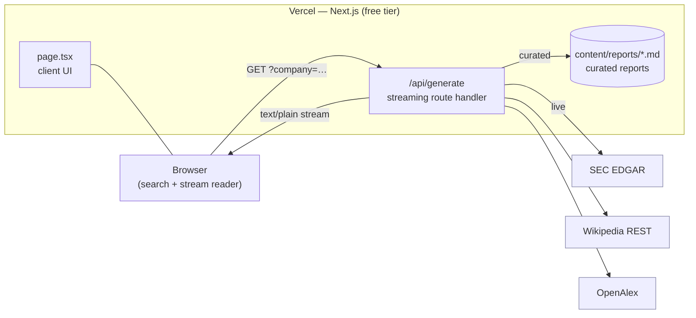
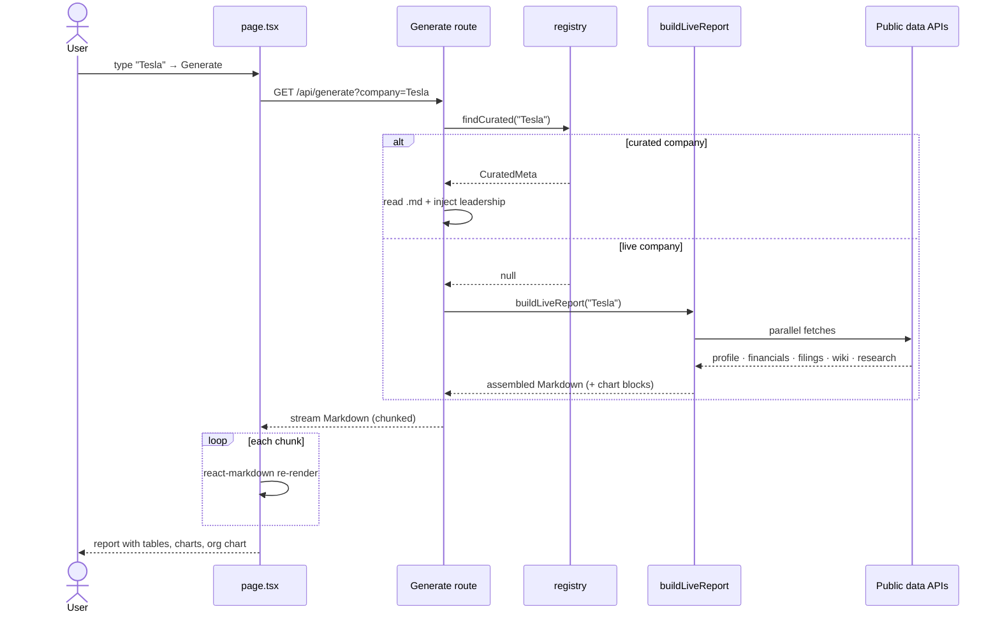
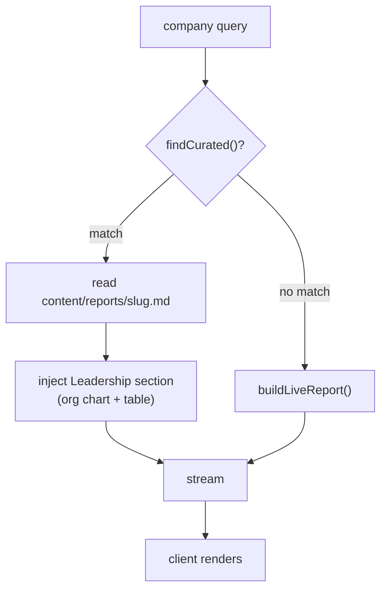
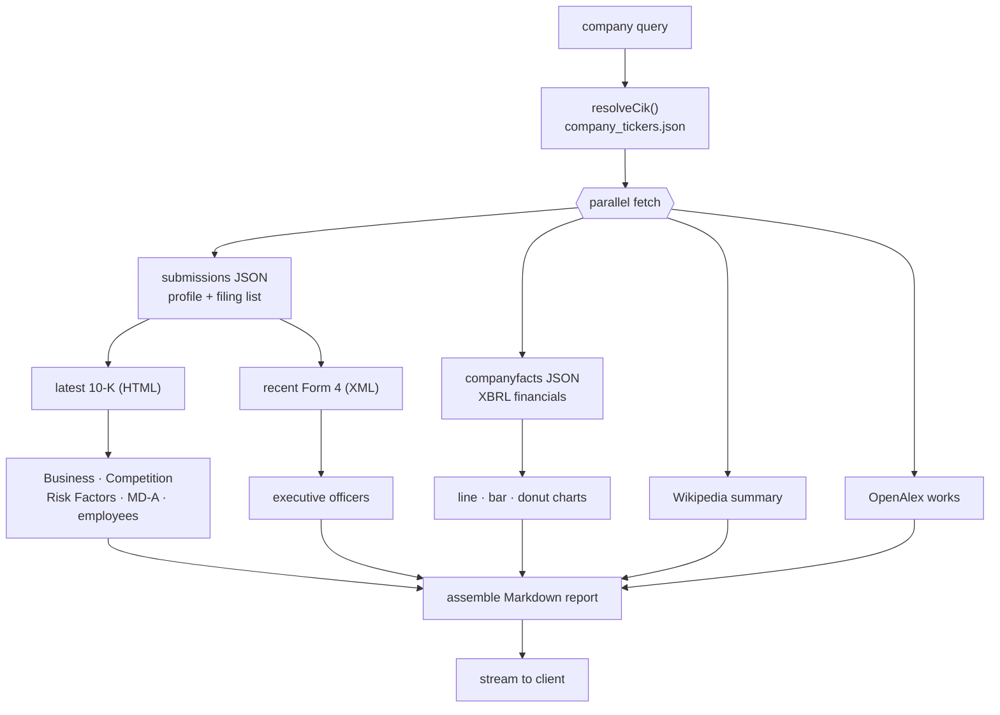
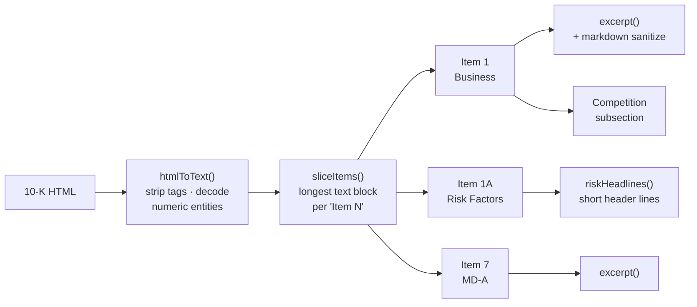
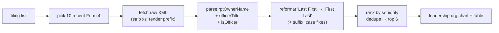
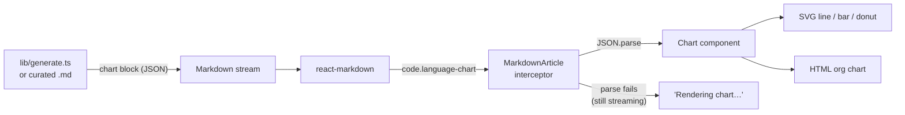
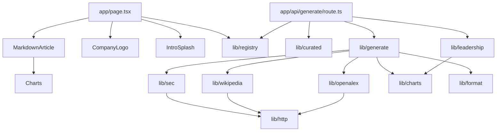

# Map — Company Intelligence Reports

**Live:** https://deep-dive-gen.vercel.app · **Stack:** Next.js 15 · React 19 · TypeScript

Deep Dive generates structured, board-ready "Company Deep Dive" reports for any public
company — full financial statements, narrative pulled straight from the company's SEC
filings, leadership org charts, and data visualizations.

The hard constraint behind every design decision: **completely free to run.**

> **No language model. No API keys. No per-use cost.**
> Every number, sentence, and chart traces to a free, keyless public data source.

Because nothing in the request path costs money, the app can stay online on a free tier
forever, and anyone can fork and deploy it without signing up for anything.

---

## Table of contents

- [How it's free](#how-its-free)
- [System architecture](#system-architecture)
- [Request lifecycle](#request-lifecycle)
- [The two report paths](#the-two-report-paths)
- [Live report assembly pipeline](#live-report-assembly-pipeline)
- [Data sources](#data-sources)
- [10-K narrative extraction](#10-k-narrative-extraction)
- [Executive extraction (Form 4)](#executive-extraction-form-4)
- [Financial data (XBRL)](#financial-data-xbrl)
- [The chart system](#the-chart-system)
- [Module map](#module-map)
- [Project structure](#project-structure)
- [Local development](#local-development)
- [Deployment](#deployment)
- [Limitations](#limitations)

---

## How it's free

A normal "AI report generator" calls an LLM, which costs money and needs a key. Deep Dive
replaces the LLM with two ideas:

1. **Curated reports** — seven marquee companies (Apple, NVIDIA, Microsoft, Alphabet, AWS,
   Anthropic, OpenAI) are hand-written deep dives, grounded in real SEC numbers and stored
   as Markdown in the repo. They render instantly with zero network calls.
2. **Live reports** — any other public company is assembled on demand from **free, keyless**
   public APIs (SEC EDGAR, Wikipedia, OpenAlex). No synthesis model — the narrative is the
   company's *own* words, lifted from its latest 10-K.

The only "AI-shaped" thing missing is original prose for arbitrary companies, which is
exactly the part that isn't free. Everything else — financials, risk factors, strategy,
competition, leadership, charts — is real public data, rendered well.

---

## System architecture



- The frontend is a single client component that opens a streaming `fetch` and feeds chunks
  into `react-markdown`.
- The backend is one **streaming route handler** (`/api/generate`). It runs on Vercel's Node
  serverless runtime, calls only public APIs, and streams Markdown back in ~220-character
  chunks so the report renders progressively.
- Curated Markdown files are bundled into the serverless function via
  `outputFileTracingIncludes` so they're readable at runtime.

---

## Request lifecycle



---

## The two report paths



`findCurated()` normalizes the query (lowercase, strip punctuation) and matches it against
each curated company's slug, name, ticker, and aliases — so `AAPL`, `apple`, and
`Apple Inc.` all resolve to the curated Apple report, while `claude` → Anthropic and
`chatgpt` → OpenAI.

---

## Live report assembly pipeline

For a non-curated company, `buildLiveReport()` fans out to every free source in parallel,
then assembles a full report section by section.



The assembled report contains: Executive Summary · Company Overview · Strategic Direction
(10-K Business) · Business Model & Financials (tables **and** charts) · Competitive
Positioning (10-K Competition) · Key Risks (10-K risk factors) · Recent SEC Filings ·
Research Signals · Outlook (10-K MD&A) · **Leadership** (org chart) · Sources.

---

## Data sources

Every source below is **free and requires no API key**. SEC asks for a descriptive
`User-Agent`, which `lib/http.ts` sets on every request.

| Source | Endpoint | Provides |
|---|---|---|
| SEC ticker DB | `sec.gov/files/company_tickers.json` | name/ticker → CIK resolution |
| SEC submissions | `data.sec.gov/submissions/CIK…json` | HQ, industry, exchange, filing history |
| SEC company facts | `data.sec.gov/api/xbrl/companyfacts/CIK…json` | multi-year XBRL financials |
| SEC archives | `sec.gov/Archives/edgar/data/…` | 10-K (HTML), Form 4 (XML) |
| Wikipedia | `en.wikipedia.org/api/rest_v1/page/summary/…` | narrative company overview |
| OpenAlex | `api.openalex.org/works?…` | recent research output |
| ui-avatars | `ui-avatars.com/api/…` | executive initials avatars (client) |
| Favicons | Clearbit / DuckDuckGo / Google | company logos (client, with fallback) |

HTTP responses are cached at the edge via Next's `revalidate` (e.g. the 1 MB ticker file
for a day) to keep cold-start latency and request volume low.

---

## 10-K narrative extraction

The narrative sections are the company's own words, parsed from the most recent 10-K. This
is where most of the engineering lives, because 10-K HTML is large and inconsistent.



Key tricks:

- **`sliceItems()`** indexes every `Item N` marker and keeps the *longest* block per item —
  the real section, not the table-of-contents line that repeats the same headings.
- **`htmlToText()`** decodes numeric HTML entities (`&#8217;` → `'`) so smart quotes render
  correctly, and preserves block boundaries as newlines so headers stay on their own lines.
- **`excerpt()`** trims to a sentence boundary and **sanitizes Markdown** (escaping `*_` etc.,
  stripping `[]<>`) so raw filing text can never break the rendered report.
- **`riskHeadlines()`** heuristically pulls the short bold-style risk-category lines
  (e.g. Tesla's *"Risks Related to Our Operations"*).

---

## Executive extraction (Form 4)

Leadership for live companies comes from **SEC Form 4** filings (insider transactions),
whose raw XML carries each reporting owner's name and officer title — far more reliable
than parsing the 10-K's officer table.



Names arrive as `Last First Middle [Suffix]` and are reordered, suffix-aware
(`Ford William Clay Jr` → `William Clay Ford Jr`), with title casing normalized
(`PRESIDENT &amp; CEO` → `President & CEO`). Curated companies use a hand-verified C-suite
instead.

---

## Financial data (XBRL)

`fetchFinancials()` reads the SEC's XBRL "company facts" and builds clean annual series.
Companies re-tag the same line item over time (e.g. `Revenues` →
`RevenueFromContractWithCustomerExcludingAssessedTax`), so a single concept leaves gaps.
`mergedAnnual()` fills each fiscal year from the **highest-priority concept that reports
it**, yielding a continuous multi-year series for revenue, gross profit, operating income,
net income, R&D, assets, liabilities, equity, and buybacks. These power both the tables and
the charts.

---

## The chart system

Charts are **dependency-free** — hand-rolled SVG (line/bar/pie/donut) and HTML
(org-chart hierarchy). They travel *inside the Markdown* as fenced `chart` code blocks
carrying a JSON spec, and are intercepted at render time.



This keeps charts in the same streaming pipeline as the rest of the report. While a chart
block is still streaming (incomplete JSON), the interceptor shows a placeholder instead of
raw text; once the closing fence arrives it parses and renders. Live reports auto-emit
revenue line, revenue-vs-net-income bar, margin-trend line, a revenue-allocation donut, and
a leadership org chart; curated reports add tailored charts (segment donuts, valuation bars,
investor splits).

---

## Module map



---

## Project structure

```
deep-dive-gen/
├── app/
│   ├── page.tsx                  # search UI, streaming reader, TOC, export, intro
│   ├── globals.css               # design system + chart/animation styles
│   ├── api/generate/route.ts     # streaming route: curated vs live
│   └── components/
│       ├── MarkdownArticle.tsx   # react-markdown + chart-block interceptor
│       ├── Charts.tsx            # SVG line/bar/donut + HTML org chart
│       ├── CompanyLogo.tsx       # logo with favicon/avatar fallback chain
│       └── IntroSplash.tsx       # book-stacking intro animation
├── lib/
│   ├── registry.ts               # curated company list + resolver + C-suite
│   ├── curated.ts                # reads curated markdown
│   ├── generate.ts               # live report assembler (sections + charts)
│   ├── sec.ts                    # EDGAR: CIK, profile, XBRL, 10-K, Form 4
│   ├── wikipedia.ts / openalex.ts
│   ├── charts.ts                 # chart-block builders
│   ├── leadership.ts             # leadership section (avatars, LinkedIn, org chart)
│   ├── format.ts                 # money/percent/YoY formatting
│   ├── http.ts                   # fetch helpers (User-Agent, edge cache)
│   └── types.ts
└── content/reports/*.md          # the 7 curated deep dives
```

---

## Local development

```bash
npm install
npm run dev
# open http://localhost:3000
```

No environment variables are required.

---

## Deployment

The app is a standard Next.js project and deploys to Vercel's free tier with **no
environment variables**:

```bash
npm i -g vercel
vercel --prod --yes
```

Or push to GitHub and import at vercel.com/new. The result is a permanent public URL that
stays free because nothing in the request path costs money.

---

## Limitations

These all follow directly from the "no paid APIs" rule, and the UI is honest about them:

- **Private companies** (no SEC filings) get a lighter, Wikipedia-grounded profile.
- **LinkedIn links** are people-search URLs, not exact profile deep-links (no free API
  returns those).
- **Executive avatars** are generated initials, not photos (real headshots aren't freely
  licensed for arbitrary executives).
- **Live narrative** is the company's own 10-K text, not original analysis — that's the one
  thing an LLM would add, and the one thing that isn't free.

---

*Data: U.S. SEC EDGAR · Wikipedia · OpenAlex. For informational purposes only; not
investment advice.*
