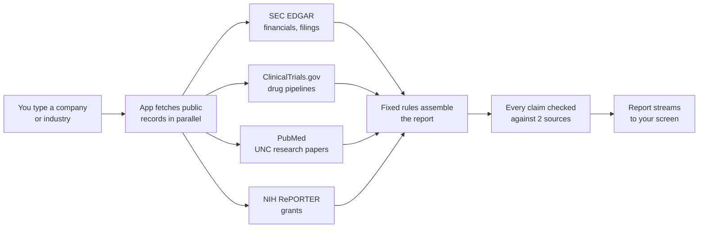
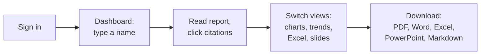

# How Map Works

One page brief.

## The goal

Partnership teams research companies by hand. It takes hours. Map does the mechanical part in about a minute, under three rules:

1. **Free.** No paid services. No accounts or keys to run reports.
2. **Sourced.** Every fact links to an official public record.
3. **No AI text.** Report words come from official filings and public databases, assembled by fixed rules.

## What it does

Three tools behind one sign in:

| Tool | You type | You get |
|---|---|---|
| Company Deep Dive | a public company | full report: business, financials, risks, leadership, charts |
| Sector Scan | an industry | report mapping companies to UNC Chapel Hill research, plus charts, trends, a spreadsheet, a slide deck |
| Accounts | nothing | 142 verified partner profiles, downloadable |

Seven major companies (Apple, NVIDIA, Microsoft, Alphabet, AWS, Anthropic, OpenAI) have hand written reports that load instantly. Everything else is built live from public records.

## How it works

Key points:

* Deep dive narrative is the company's own words from its latest annual report.
* Sector scan claims need two official sources. Unverified claims get flagged for human review, not guessed.
* Wikipedia and news aggregators are never citations.
* The progress bar shows real work ("4 of 18 companies analyzed"), not a timer.

## How to use it

1. Sign in with email, Google, or Microsoft.
2. Type a company or industry on the Dashboard.
3. Read the report. Click any citation to verify it.
4. For sector scans, switch views: Report, Visualize, Trends, Excel, Slide Deck.
5. Download in any format. The Accounts tab holds the partner database.

## Keep in mind

* Private companies have no filings, so their reports are lighter.
* Reports are drafts. Verify before acting.
* Independent project. Not affiliated with UNC Chapel Hill. Not investment advice.
