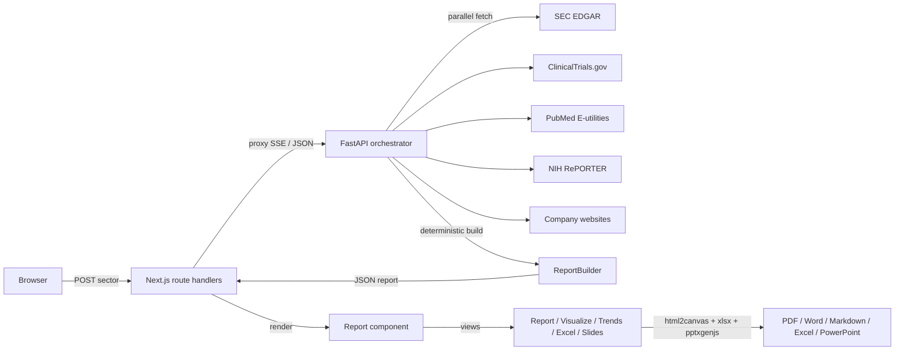

# map - sector-scan-reports
<p>
  
  
  
  
  
  
</p>


Search any sector, using information retrived from SEC EDGAR advanced search, PubMed, Company Websites and UNC Chapel Hill Websites, genarating a fully sourced report that maps public companies to overlapping research at UNC Chapel Hill, scored and citation checked, in about a minute.


> **Disclaimer.** This is an independent project. It is **not** created by,
> affiliated with, or endorsed by UNC Chapel Hill or any of its offices. UNC
> appears only as the analytical subject of the reports the tool generates.


| | |
|---|---|
| **Web app** | https://aria-pi-frontend.vercel.app |
| **API** | https://aria-pi-api.vercel.app |
| **Status** | Live · free tier · no third-party API keys required |

---

## Table of contents

1. [What it does](#what-it-does)
2. [Key features](#key-features)
3. [Data integrity rules](#data-integrity-rules)
4. [Report structure](#report-structure)
5. [Workspace views](#workspace-views)
6. [Architecture](#architecture)
7. [Tech stack](#tech-stack)
8. [Repository layout](#repository-layout)
9. [Data sources](#data-sources)
10. [API reference](#api-reference)
11. [Export behavior](#export-behavior)
12. [Local development](#local-development)
13. [Environment variables](#environment-variables)
14. [Deployment](#deployment)
15. [Performance and limits](#performance-and-limits)
16. [Known limitations](#known-limitations)
17. [Roadmap](#roadmap)
18. [License](#license)

---

## What it does

Given a sector — for example `Oncology`, `FinTech`, or a free-text term like `AI & Machine Learning` — the tool assembles a partnership intelligence report:

1. Resolves the sector to a company roster (24 curated sectors plus NC-based seeds, or live SEC EDGAR full-text discovery for any other term).
2. Pulls primary-source data per company, in parallel, from SEC EDGAR, ClinicalTrials.gov, PubMed, NIH RePORTER, and company websites.
3. Validates every claim against the two-source rule and source blocklist before any prose is written.
4. Builds a deterministic seven-section report plus a one-page executive summary, with every quantified claim backed by at least two citable URLs.
5. Streams real progress to the browser as each company resolves, then renders an interactive report with a live table of contents.
6. Opens the same data in a multi-view workspace: **Report**, **Visualize** (23 sector-specific charts including a rotating 3D connection orbit, network diagram, Sankey flow, and more), **Trends** (10-year SEC financial trajectories), **Excel** (18-sheet analytics workbook), and **Slide Deck** (speaker-noted, per-sector PowerPoint).
7. Exports to Markdown, PDF, and Word, with on-screen layout preserved.

Every factual claim carries its source URLs. Anything that cannot be double-sourced is flagged for analyst review rather than guessed.

---

## Key features

- **No API keys required.** All data comes from free, public primary sources. No paid data provider, no account required to run a report.
- **Live progress streaming.** The backend emits Server-Sent Events as each company completes, so the progress UI reflects genuine work, not a timer.
- **Sector resolution.** 24 curated sectors (top 15 global + NC-based seeds) plus live SEC EDGAR full-text discovery for any other term. Resolution path is labeled (`curated` / `discovered` / `default`) in every report.
- **Source-verified claims.** Two-source rule, domain blocklist (no Wikipedia or aggregators), and a per-report verification count.
- **One-page executive summary.** Metric tiles, sector thesis, UNC fit rationale, and ranked BD angles — first in the report.
- **Interactive report.** Inline AMA citations, data visualizations distributed through the sections, and a floating scroll-spy table of contents.
- **Multi-view workspace.** A top nav (Home / Report / Visualize / Trends / Excel / Slide Deck) turns one report's data into five sector-customized views.
- **Visualize.** 23 unique, per-sector charts led by a rotating 3D connection orbit (companies circling a central UNC node, hover to pause), plus a 3D isometric scatter, a connection network, a Sankey flow, correlation matrix, Lorenz curve, Pareto, box plots, and a radar. Soft gradient fills, rounded bars, and gentle card shadows.
- **Trends.** Stock-style 10-year SEC financial trajectories (revenue, R&D, net income) with CAGR and momentum. Thin-coverage years are dropped so a partial fiscal year never distorts the line.
- **Excel workspace.** An 18-sheet analytics workbook (HHI concentration, correlation matrix, quartiles, CAGR, partnership-priority scores, segments) with on-screen analytics and live clickable worksheet previews.
- **Slide deck.** A bullet-driven, graduate-level, per-sector deck with speaker notes, exportable to PowerPoint.
- **High-fidelity exports.** Markdown (editable, fully linked), PDF, and Word — all three capture the rendered report so they match the web view.
- **Responsive.** Lays out cleanly on phones and tablets. The floating table of contents is hidden below 1380px. Markdown export is always fast on mobile; PDF and Word are better on a laptop for large reports.
- **Animated intro.** A network-graph splash that builds out from a central node before handing off to the app.

---

## Data integrity rules

These rules run before any claim reaches the report. They are not guidelines — the pipeline enforces them.

### Source hierarchy

Higher tiers beat lower tiers when they conflict. An SEC figure always overrides a third-party estimate of the same thing.

| Tier | Source | Used for |
|---|---|---|
| 1 | SEC / EDGAR filings (10-K, 10-Q, 8-K, S-1, 6-K, 20-F) | All public-company financial figures |
| 2 | PubMed, arXiv, OpenAlex, SSRN | Research footprint and co-authorship |
| 3 | ClinicalTrials.gov v2 API | Sponsor-matched trial data |
| 4 | NIH RePORTER | Active grants naming a company and UNC |
| 5 | Company websites, press releases, UNC unit pages | Products, HQ, leadership, UNC research programs |
| 6 | Primary government sources (FDA, CMS, ONC, NIST) | Policy and regulatory context |
| 7 | Third-party research (market sizing, funding totals) | Directional context only — always flagged in-text |

### Two-source rule

Every quantified claim must be supported by at least two independent sources from Tiers 1–6 before it appears in the report. Claims supported only by Tier 7 are flagged as directional and never used as the sole basis for a number attributed to a public company.

### Source blocklist

These are rejected at fetch time and never cited:

- Wikipedia and any wiki-family site
- News aggregators and content farms
- Unattributed press releases with no corporate signatory
- LinkedIn (pre-filled search links only — never scraped)
- Any source without a stable, citable URL

### Financial figures

All public-company revenue, R&D spend, and growth figures come from SEC filings (FY2024–FY2025). Private-company valuations and ARR figures from company announcements are cited and flagged. Market-size figures from research houses are directional, shown as a range when sources diverge, and never the sole basis for a claim.

### Sponsor matching

Clinical trials are matched on the sponsor and collaborator fields in the ClinicalTrials.gov API response, not on free-text keyword proximity. Trials are never attributed to a company because they mention a related term in the description.

### Typography rule

Generated reports never contain em dashes or en dashes. Sentences are short. No filler phrases.

---

## Report structure

Every report is a fixed seven-section document preceded by a one-page executive summary. Section order and the "so-what" framing at the end of each section are part of the output contract — they do not change between sectors.

| # | Section | Contents |
|---|---|---|
| Summary | Executive brief | Metric tiles, sector thesis, UNC fit rationale, top three BD angles |
| 1 | Sector overview | Definition, scale, current dynamics, NC context, active UNC units; revenue and R&D charts |
| 2 | Internal mapping | Known UNC partnerships, faculty leads, data assets, risk flags; alignment chart |
| 3 | Company selection | How the roster was built; included vs. excluded; UNC-tie and partnership-scale charts |
| 4 | Company profiles | Per-company: SEC financials, recent filings, pipeline, UNC alignment signals, alumni detection |
| 5 | Value proposition | UNC data assets, research capacity, talent pipeline, NC access points, engagement models |
| 6 | Talking points | Sourced, per-company outreach angles ranked by probability of a near-term win |
| 7 | References | AMA-style, de-duplicated, numbered, grouped by source tier |

### BD priority framing

Section 6 talking points are always ranked "ordered by probability of a near-term win." The highest-priority angle is always labeled as such. This framing is fixed across all sectors so the BD team can scan the same location in every report.

---

## Workspace views

The top nav exposes five views over the same generated report data. Each is sector-customized and independently downloadable.

| View | What it shows | Export |
|---|---|---|
| **Report** | Sourced seven-section report plus one-page summary, inline citations, floating TOC | Markdown, PDF, Word |
| **Visualize** | 23 sector-specific charts: rotating 3D connection orbit, 3D isometric scatter, connection network, Sankey flow, correlation matrix, Lorenz curve, Pareto, box plots, radar, heatmap | Captured in PDF / Word |
| **Trends** | 10-year SEC financial trajectories (revenue, R&D, net income), CAGR, growth momentum; thin-coverage years dropped | — |
| **Excel** | 18-sheet analytics workbook with live clickable worksheet previews and on-screen analytics | `.xlsx` |
| **Slide Deck** | Bullet-driven, graduate-level, per-sector deck with speaker notes | `.pptx` |

Analytics powering Visualize, Trends, and Excel (`report-analytics.ts`): HHI concentration, Pearson correlation matrix, quartile and five-number summaries, CAGR, a 0–100 partnership-priority score, percentile ranks, Lorenz curve, and segment analysis.

---

## Architecture

### Pipeline stages (in order)

```
sector input
  └─▶ sector resolution       resolve to company roster (curated / EDGAR discovery / default)
        └─▶ parallel fetch    SEC + ClinicalTrials + PubMed + NIH + company sites (concurrent, hard deadline)
              └─▶ source validation    two-source rule + blocklist check per claim
                    └─▶ report assembly     seven sections built deterministically from verified JSON
                          └─▶ stream to client   SSE progress events, then full report JSON
```

### Sector resolution

The pipeline resolves a sector string in this order:

1. Check against 24 curated sectors (top global + NC-anchored). If matched, use the curated roster.
2. If not matched, run a live SEC EDGAR full-text search against the sector term and build a roster from results.
3. If EDGAR returns nothing useful, fall back to a default broad-tech roster.

The resolution path (`curated` / `discovered` / `default`) is labeled in every report's `_meta` block.

### Concurrency and time budget

Up to 22 companies are fetched in parallel under a hard 44-second data-collection deadline so the function stays within Vercel's 60-second cap. Companies that miss the deadline keep an SEC-only stub. The report still renders.

### Streaming

The backend emits Server-Sent Events as each company resolves. The browser receives live "N of M analyzed" updates before the full report arrives. If SSE is unavailable, the frontend falls back to a single JSON request with a cosmetic progress animation.

```
sector ─▶ /api/run-pipeline-stream ─▶ /run-pipeline-stream (backend)
        ◀─ stage:resolved   (total companies, resolution label)
        ◀─ progress         (done / total / company name)
        ◀─ stage:building
        ◀─ stage:verifying
        ◀─ done             (full report JSON)
        ◀─ error            (client falls back to non-stream path)
```

### System diagram



**Two independently deployed Vercel projects:**

- **`aria-pi-frontend`** — Next.js app. Client renders the report, drives all five workspace views, and builds exports. Server-side route handlers proxy all backend calls so the browser never contacts the API directly and no stale cache is served.
- **`aria-pi-api`** — FastAPI app on the `@vercel/python` runtime. Resolves the company roster, fans out to the five public data sources concurrently within the hard time budget, validates sources, and assembles the report deterministically.

---

## Tech stack

| Layer | Technology |
|---|---|
| Frontend | Next.js 14 (App Router), React 18, TypeScript 5 |
| Charts | Hand-rolled inline SVG — no chart library — including animated 3D |
| Exports | `docx`, `jspdf`, `html2canvas`, `xlsx` (SheetJS), `pptxgenjs` |
| Backend | FastAPI, Pydantic, `requests` (Python 3.12) |
| Runtime | Vercel (Next.js + `@vercel/python` serverless) |
| Data | SEC EDGAR, ClinicalTrials.gov, PubMed, NIH RePORTER, company websites |
| Optional | Anthropic Claude (synthesis path — off by default; no key required for core reports) |

---

## Repository layout

```
research-graph/
├── aria-pi-frontend/                        # Next.js web app  (Vercel: aria-pi-frontend)
│   ├── public/
│   │   └── flow.html                        # standalone system data-flow diagram
│   └── src/
│       ├── app/
│       │   ├── page.tsx                     # intro + search + streaming progress + report mount
│       │   ├── layout.tsx
│       │   ├── globals.css
│       │   └── api/
│       │       ├── run-pipeline/route.ts             # JSON proxy to backend
│       │       └── run-pipeline-stream/route.ts      # SSE proxy to backend
│       ├── components/
│       │   ├── Report.tsx                   # report renderer, inline citations, TOC
│       │   ├── VisualsView.tsx              # Visualize: 23 charts + diagrams
│       │   ├── TrendsView.tsx               # Trends: 10-year SEC trajectories
│       │   ├── Chart3D.tsx                  # rotating orbit + isometric 3D scatter (SVG)
│       │   └── Intro.tsx                    # animated network-graph splash
│       └── lib/
│           ├── report-analytics.ts          # HHI, correlation, quartiles, priority scores
│           ├── report-excel.ts              # 18-sheet .xlsx workbook builder
│           ├── report-slides.ts             # per-sector .pptx deck + speaker notes
│           └── report-export.ts             # Markdown / PDF / Word exporters
│
└── aria-pi-backend/                         # FastAPI service  (Vercel: aria-pi-api)
    ├── api/index.py                         # Vercel ASGI entry point
    ├── vercel.json                          # @vercel/python build config
    └── aria_pi/
        ├── orchestrator.py                  # FastAPI app + endpoints + concurrency
        ├── sectors.py                       # sector resolution — curated + NC seeds + EDGAR discovery
        ├── clients/
        │   ├── sec_edgar_client.py          # facts, XBRL financials, discovery, DEF 14A
        │   ├── clinicaltrials_client.py     # sponsor-matched trial fetch
        │   ├── pubmed_client.py             # UNC co-authorship lookup
        │   ├── nih_reporter_client.py       # active grants fetch
        │   ├── company_site_client.py       # company website and press release fetch
        │   └── claude_client.py             # optional LLM synthesis path (off unless key set)
        ├── builders/
        │   ├── report_builder.py            # deterministic seven-section assembly
        │   └── source_validator.py          # two-source rule + blocklist enforcement
        ├── models/                          # Pydantic models
        └── data/                            # curated UNC units, datasets, programs
```

Each file has one concern. Functions follow the `given / return` docstring format. No file exceeds 150 lines of logic.

> Note: top-level `src/` and `aria_pi/` directories are a stale early prototype and are gitignored. The active apps live under `aria-pi-frontend/` and `aria-pi-backend/`.

---

## Data sources

All free. All primary-source. No API keys required for core functionality.

| Source | What it provides | Endpoint |
|---|---|---|
| SEC EDGAR | Company facts, XBRL financials, full-text discovery, DEF 14A proxy statements | `data.sec.gov`, `efts.sec.gov` |
| ClinicalTrials.gov v2 | Sponsor-matched trials, phases, collaborators | `clinicaltrials.gov/api/v2/studies` |
| PubMed E-utilities | UNC co-authored publications by school or institute | `eutils.ncbi.nlm.nih.gov` |
| NIH RePORTER | Active grants naming a company alongside UNC | `api.reporter.nih.gov/v2/projects/search` |
| Company websites | Products, HQ, leadership, press releases | Direct fetch per company |
| UNC unit pages | Active research programs, institutes, faculty leads | Direct fetch — curated seed list |

---

## API reference

Base URL: `https://aria-pi-api.vercel.app`

### `GET /status`

Health check. Returns mode, version, and whether the Claude synthesis path is active.

### `POST /run-pipeline`

Runs the full pipeline and returns the completed report as a single JSON payload.

```jsonc
// request
{
  "sector": "HealthTech",
  "companies": ["Tempus AI", "Natera"]   // optional — omit to use resolved roster
}

// response
{
  "sector": "HealthTech",
  "status": "COMPLETED",
  "resolution": "curated",
  "data": {
    "report_meta": { ... },
    "summary": { ... },
    "section1_overview": { ... },
    // ... through section7
    "references": [ ... ],
    "_validation": { "claims_checked": 84, "claims_flagged": 2 },
    "_meta": { "resolution": "curated", "seeds": [ ... ] }
  }
}
```

### `POST /run-pipeline-stream`

Same pipeline, delivered as Server-Sent Events (`text/event-stream`).

| `type` | Payload | Meaning |
|---|---|---|
| `stage` | `{ key: "resolved", total, resolution }` | Roster is locked |
| `progress` | `{ done, total, company }` | One company finished |
| `stage` | `{ key: "building" }` | Assembling sections |
| `stage` | `{ key: "verifying" }` | Source validation pass |
| `done` | `{ report }` | Full report object |
| `error` | `{ message }` | Pipeline failure — client falls back to non-stream path |

---

## Export behavior

Three export formats are available from the report toolbar. All are generated client-side from the rendered report.

| Format | How it's built | Best for |
|---|---|---|
| **PDF** | `jspdf` + `html2canvas` DOM capture, paginated | Sharing and printing |
| **Word (.docx)** | `docx` library built from structured report JSON | Editing and annotating |
| **Markdown (.md)** | Plain text serializer, all citation links preserved | Archiving, version control, editing |

PDF and Word capture the rendered report as-is, preserving charts and layout. Markdown is the lightest format — links stay clickable and the file stays small regardless of report length.

Large reports (20+ companies) can reach 70–95 pages as PDF or Word and take roughly 20 seconds to build. Markdown is instant. Excel and PowerPoint are generated from data and stay small regardless of company count.

---

## Local development

Two services. Two terminals.

### Backend

```bash
cd aria-pi-backend
python -m venv .venv && source .venv/bin/activate
pip install -r requirements.txt
uvicorn aria_pi.orchestrator:app --reload --port 8000
# http://localhost:8000/status
```

### Frontend

```bash
cd aria-pi-frontend
npm install
echo 'BACKEND_API_URL=http://localhost:8000' > .env.local
npm run dev
# http://localhost:3000
```

### Tests

```bash
cd aria-pi-backend && pytest
```

The test suite covers source validation (two-source rule, blocklist), sector resolution, and report assembly. Claude synthesis is mocked in tests — no live API calls are made in CI.

---

## Environment variables

### Frontend (server-side only — never exposed to the browser)

| Variable | Required | Default | Description |
|---|---|---|---|
| `BACKEND_API_URL` | No | Live API alias | Points the proxy at a local or staging backend |
| `VERCEL_AUTOMATION_BYPASS_SECRET` | No | — | Only needed if the backend project has Deployment Protection enabled |

### Backend

| Variable | Required | Default | Description |
|---|---|---|---|
| `ANTHROPIC_API_KEY` | No | — | Enables the optional Claude synthesis path. Omitted = deterministic builder (default) |
| `ANTHROPIC_MODEL` | No | `claude-sonnet-4-6` | Override the synthesis model when the key is set |

The tool runs fully without any API key. The Claude synthesis path is additive — it does not change the source validation rules or the report structure.

---

## Deployment

Both projects deploy to Vercel from the CLI. GitHub pushes do not auto-deploy these two projects.

```bash
# backend
cd aria-pi-backend && npx vercel --prod

# frontend
cd aria-pi-frontend && npx vercel --prod
```

- **Frontend:** standard Next.js build (`aria-pi-frontend/vercel.json`).
- **Backend:** `@vercel/python` builds `api/index.py`, bundling `aria_pi/**`. Function `maxDuration` is 60 seconds (`aria-pi-backend/vercel.json`).

---

## Performance and limits

- **Concurrency budget.** Up to 22 companies are fetched in parallel under a hard ~44-second data-collection deadline. Companies that miss the deadline keep an SEC-only stub; the report still renders.
- **Streaming cadence.** Progress events fire as each company resolves, giving granular "N of M analyzed" feedback.
- **Export size.** PDF and Word capture the rendered DOM as paginated images, so large reports (20+ companies) can run 70–95 pages and take ~20 seconds to build. Markdown is lightweight and instant. Excel and PowerPoint are generated from data and stay small.
- **Mobile.** The UI is responsive on iPhone and iPad. The image-based PDF and Word capture is memory-heavy — large exports (90+ pages) are slow on a phone and better done on a laptop. Markdown, Excel, and PowerPoint exports are light and fine on mobile. The floating table of contents is hidden below 1380px.

---

## Known limitations

- Private companies (no SEC filings) produce partial profiles. Financial sections are omitted. Trials, publications, and grants still appear.
- UNC alumni detection reads DEF 14A proxy statements and named leadership pages. It covers board members and named executives, not every employee. LinkedIn cannot be scraped — pre-filled search links are provided instead.
- Reports are drafts. The tool removes mechanical sourcing labor. It does not replace analyst judgment. Verify claims before any outreach.

---

## Roadmap

- Internal relationship database to replace flat-file UNC seeds.
- Report versioning and diffs across time for the same sector.
- Optional selectable-text PDF mode alongside the pixel-perfect DOM capture.
- CRM-ready structured export.

---

## License

MIT. See `LICENSE`.
